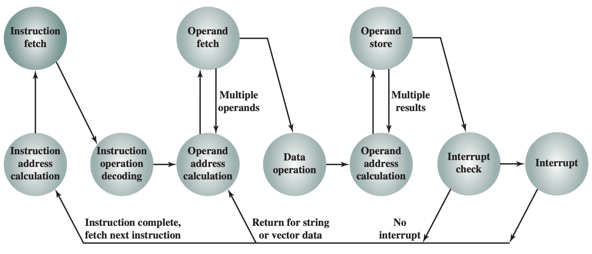

## Computer components

!!! note "Overview of components"

    System bus connects *CPU*, *memory*, and *I/O devices*.

    The key design concepts of Von Neumann architecture are:
    - Data and instructions are stored in a **single** read-write *memory*.
    - The contents of memory are addressable by location.
    - Execution occurs in sequential fashion.

!!! note "Key terms"

    - **Byte**: 8 bits
    - **Word**: Unit of memory, e.g. 32-bit word
    - **Registers**: Small amount of fast storage inside CPU.
    - **Buffer**: Temporary storage for data.

!!! tip "Storage inside CPU"

    | Short | Name                       | Holds                                                                 |
    |---|---|---|
    | PC    | Program Counter            | Address of next instruction                                             |
    | IR    | Instruction Register       | Current instruction                                               |
    | MAR   | Memory Address Register    | Address of memory location                                        |
    | MBR   | Memory Buffer Register     | Data to be written to memory or data read from memory             |
    | I/O AR | I/O Address Register      | Address of I/O device                                             |
    | I/O BR | I/O Buffer Register       | Data to be written to/read from I/O device   |


## Instructions

!!! info "Instruction format"

    Instructions executed by CPU is in **32-bit** binary format, and can be one-word or multi-word. 

    We usually represent an instruction as in hexadecimal format.

!!! tip "One word instructions"

    One-word instructions are 4 bytes long, and the instruction format is as follows:

    ```math
    \underbrace{\text{[  Operator code (OC)  ]}}_{1\text{ byte}}\underbrace{\text{[  Source operand 1 (src1)  ]}}_{1\text{ byte}}\underbrace{\text{[  Source operand 2 (src2)  ]}}_{1\text{ byte}}\underbrace{\text{[  Result destination (dst)  ]}}_{1\text{ byte}}
    ```
    
    The value from *source operands* will be operated on with the operator referenced by the *operator code* and the result will be stored in the *result destination*.

    | Operator | Code | Hex Code | Description |
    |---|---|---|---|
    | ADD      | 0000 (0) | 0x00 | Add src1 src2 |
    | SUB      | 0001 (1) | 0x01 | Subtract operands |
    | AND     | 0010 (2) | 0x02 | Bitwise AND |
    | OR      | 0011 (3) | 0x03 | Bitwise OR |
    | NOT    | 0100 (4) | 0x04 | Bitwise NOT |
    | MOV    | 0101 (5) | 0x05 | Copy src1 $\to$ dst. src2 = `0x00` | 

    !!! eg "Example ADD"
    
        `0000 0001 0010 0011` represents an addition (0000) of the numbers in memory locations 2 (0010) and 3 (0011) and store the result in memory location 1 (0001).

        The instruction might sometimes also be expressed in hex format: `0x00 01 02 03`.
    
!!! tip "Two word instructions - load and store"

    Two-word instructions are 8 bytes long, and the instruction format is as follows:

    ```math
    \underbrace{\text{[  Op code (OC)  ]}\text{[  0x00  ]}\text{[  0xff  ]}\text{[  dst  ]}}_{1\text{ WORD}}\underbrace{\text{[  Address of operand in memory (addr)  ]}}_{4\text{ bytes}}
    ```

    | Operator | Code | Hex Code | Description |
    |---|---|---|---|
    | LD       | 0110 (6) | 0x06 | Load value from memory to dst. |
    | ST       | 0111 (7) | 0x07 | Store value from dst to memory. |

!!! tip "Two word instructions - branch"

    A **condition code** is used to determine if a branch should be taken, placed in *src1*. The instruction format is as follows:

    ```math
    \underbrace{\text{[  0x08  ]}\text{[  Condition code  ]}\text{[  0xff  ]}\text{[  0x00  ]}}_{1\text{ WORD}}\underbrace{\text{[  Address of looping instruction in memory (addr)  ]}}_{4\text{ bytes}}
    ```

    | Operator | Condition code | Description |
    |---|---|---|
    | BR | 0x00 | Unconditional loop (branch) | 
    | BZ | 0x01 | Loop if last register written is zero |
    | BNZ | 0x02 | Loop if last register written is not zero |

    To be more specific, the condition code checks the zero flag of the ALU, which is determined by the previous operation.

!!! tip "Halt instruction"

    The halt instruction is a special one-word instruction that stops the CPU from executing any further instructions. 

    | Operator | Code | Hex Code | Description |
    |---|---|---|---|
    | HALT | 1011 (9) | 0x09 | Stop execution (other operands `0x00`) |

## Execution cycle

The cycle is as follows:



!!! info "Step 1. IAC Instruction address calculation"

    Address to the next instruction is stored in PC register, which is incremented automatically during execution. 
    
    For a two-word instruction, the first word is fetched first, then PC is incremented by 1 word to point to the second word. Then the second word is fetched, and PC is incremented again to point to the next instruction.

!!! info "Step 2. IF Instruction fetch"

    The following operations happen during instruction fetch:

    ```math
    MAC \leftarrow PC
    PC \leftarrow PC + 1
    IR \leftarrow mem[MAC]
    ```

!!! info "Step 3. ID Instruction decode"

    The **control unit** handles:
    * Decoding the instruction
    * Setups up CPU components like ALU at the right time

!!! info "Step 4. OA Operand address calculation"

    ...

!!! info "Step 5. OF Operand fetch"

    If the operands are in registers, data are moved from registers to ALU.
    
    If the operands are in memory, then the instruction would be a two-word instruction. Note that if PC points to the second word of a two-word instruction, after the above process, MBR will contain the address of the second word, not the content. Therefore, another memory read is needed to fetch the content, by:
    
    ```math
    MAR \leftarrow MBR\\
    MBR \leftarrow mem[MAR]
    ```

!!! info "Step 6. EX Execution"

    The ALU performs the operation specified by the instruction. The result is stored in some temporary register.
    

!!! info "Step 7. WB Write back"

    Similar to operand fetch, if the destination is in register, RF write is performed. If the destination is in memory, then operand address calculation is first performed. Then the data is written to memory.

!!! info "Interrupt handling"

    Interruptions are important as:
    * They improve efficiency.
    * When an I/O arrives, it may need immediate attention, or data may be lost. e.g. incoming data from a network.
    * Other programs may also need the CPU’s attention. e.g. on a time-sharing system.

    When interruption is required, I/O device sends a signal to the CPU. The CPU will need to remember the current state of the program, and then jump to serve the interrupt. The CPU will then return to the original program and continue execution as if nothing happened.
    
    Interrupt handlers can either be hardware or software
