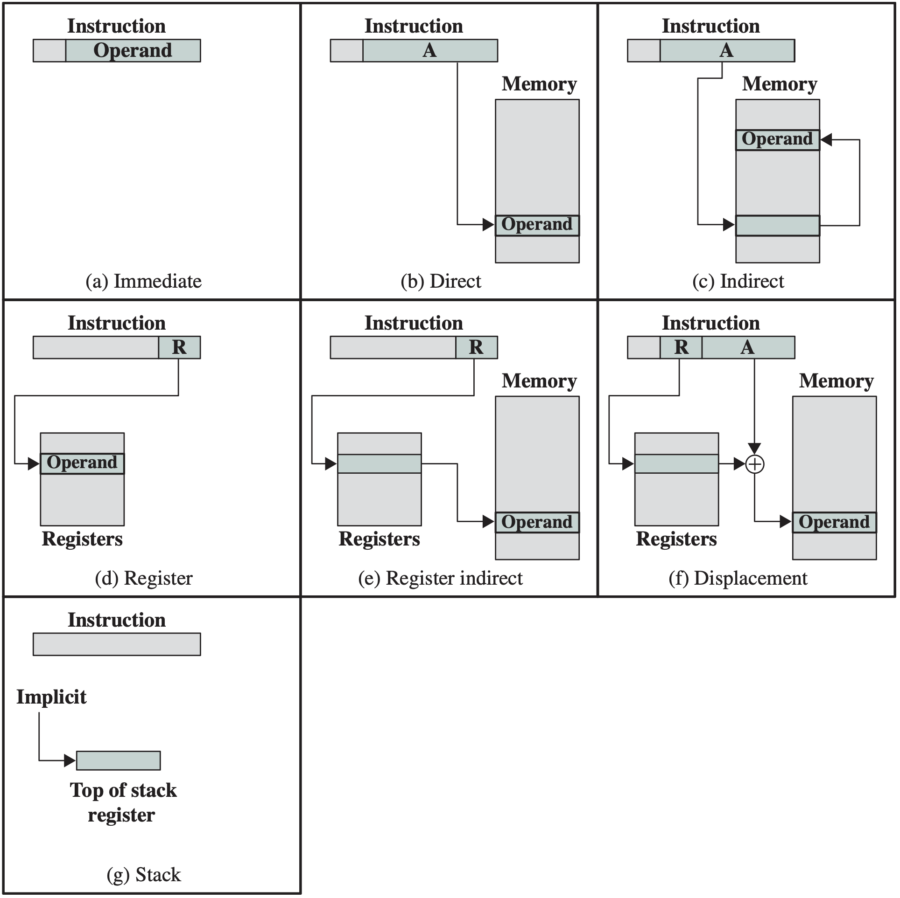
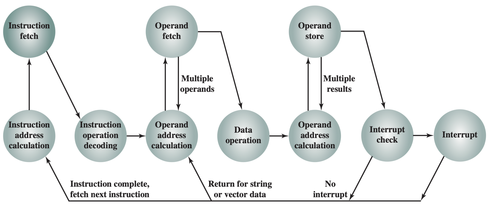

## Computer components

!!! note "Overview of components"

    System bus connects *CPU*, *memory*, and *I/O devices*.

    The key design concepts of Von Neumann architecture are:
    - Data and instructions are stored in a **single** read-write *memory*.
    - The contents of memory are addressable by location.
    - Execution occurs in sequential fashion.

!!! note "Key terms"

    - **Byte**: 8 bits
    - **Word**: Unit of memory, e.g. 32-bit word
    - **Registers**: Small amount of fast storage inside CPU.
    - **Buffer**: Temporary storage for data.

!!! tip "Storage inside CPU"

    | Short | Name                       | Holds                                                                 |
    |---|---|---|
    | PC    | Program Counter            | Address of next instruction                                             |
    | IR    | Instruction Register       | Current instruction                                             ` |
    | MAR   | Memory Address Register    | Address of memory location                                        |
    | MBR   | Memory Buffer Register     | Data to be written to memory or data read from memory             |d
    | I/O AR | I/O Address Register      | Address of I/O device                                             |
    | I/O BR | I/O Buffer Register       | Data to be written to/read from I/O device   |


## Instruction set 

!!! info "Instruction format"

    Instructions:
    * Are in **32-bit** (4-byte) binary format, and can be **one-word or multi-word**. 
    * Can be represented by **hexadecimal format** (hand-assembled). They can also be simplified to [assembly](#assembly-language-programming).
    * Instructions are made up of an **operator code (code)** and some *parameters (operands)*. 

!!! note "Types of operations"

    * Data transfer
    * Arithmetric
    * Logical
    * Control flow
    * [Input / Output](io)
    * Data conversion

    **Arithmetric** operations treat operands as numbers, and has to consider the sign of operands.

    **Logical** operations treat operands as *bit patterns*

!!! tip "Course instruction set"

    The following is our list of instructions, sorted by operator code:

    | Mnemonic | Assembled           | Assembly Syntax                | Description                                        | Type          |
    | -------- | ------------------- | --------------------- | -------------------------------------------------- | ------------- |
    | ADD      | `00######`          | `ADD src1, src2, dst` | Add src1 and src2, store in dst                    | Arithmetic    |
    | SUB      | `01######`          | `SUB src1, src2, dst` | Subtract src2 from src1, store in dst              | Arithmetic    |
    | AND      | `02######`          | `AND src1, src2, dst` | Bitwise AND src1 and src2, store in dst            | Logical       |
    | OR       | `03######`          | `OR src1, src2, dst`  | Bitwise OR src1 and src2, store in dst             | Logical       |
    | NOT      | `04##00##`          | `NOT src1, dst`       | Bitwise NOT src1, store in dst                     | Logical       |
    | MOV      | `05##00##`          | `MOV src1, dst`       | Copy src1 to dst                                   | Data transfer |
    | LD       | `0600ff## 000000$$` | `LD adr, dst`         | Load value from `adr` to `dst`                     | Data transfer |
    | ST       | `07##ff00 000000$$` | `ST src1, adr`        | Store value from `src1` to `adr`                   | Data transfer |
    | BR       | `0800ff00 000000$$` | `BR label`            | <u>B</u>ranch to label <u>R</u>egardless of output | Control flow  |
    | BZ       | `0801ff00 000000$$` | `BZ label`            | <u>B</u>ranch if Zero                              | Control flow  |
    | BNZ      | `0802ff00 000000$$` | `BNZ label`           | <u>B</u>ranch if <u>N</u>ot <u>Z</u>ero            | Control flow  |
    | HALT     | `09000000`          | `HLT`                 | Stops the execution                                | Control flow  |
    | PUSH     | `0A##0000`          | `PUSH r`              | Push `r` to *stack* (temp store value)            | Data transfer |
    | POP      | `0B0000##`          | `POP r`               | Pop from *stack* to `r` (restore value)            | Data transfer |
    | CALL     | `0C00ff00 000000$$` | `CALL label`          | Call function at label                             | Control flow  |
    | RET      | `0D000000`          | `RET`                 | Return from function                               | Control flow  |

    This table is useful during [assembly programming](#assembly-language-programming) and manual assembly.

    !!! info "Decoding shorthands"

        This section involve hand-assembling an [assembly program](#assembly-language-programming).

        A simplified overview for completion of assignments:

        * `src`, `r`, `dst` are a **memory registers**. In assembly syntax, it should be `R1`, `R2` etc. The assembled equivalent is the number of the register. (e.g. assembly syntax `R1` = assembed `01`, replace `##`)
        * `adr` are **addresses of memory location**. In assembly syntax, it should be `P1`, `P2` etc. The assembled equivalent is the address of memory location. (e.g. assembly syntax `P1` replace `$$` with address).     
        * `label` are also addresses, but in assembly syntax, it should be a **label**.
        
        In a program, each instruction is 4-bytes, so the address of an instruction on line $n$ is $4(n-1)$ (0-indexed). Refer to example below.

        There are other ways to specify values in assembly for `src`, `r`, `dst` and `adr`, described in [addressing modes](#addressing-modes).

    !!! eg "Example ADD"
    
        `0000 0001 0010 0011` represents an addition (0000) of the numbers in memory locations 2 (0010) and 3 (0011) and store the result in memory location 1 (0001).

        The instruction might sometimes also be expressed in hex format: `0x00 01 02 03`.

    !!! eg "Example BNZ"

        Consider the following set of instructions:

        ```
        0000H: 01010101
        0004H: 0802ff00
        0008H: 00000000
        ```
        The `BNZ` instruction on line 2 and 3 (recall `BNZ` is 2-worded) will loop back to line 1 at address (`0000H`).

!!! tip "Addressing modes"

    Addressing modes are ways you can **specify the address of an operand**. Using these methods can reduce the size of program code (as don't need to calculate address explicity), but hardware will be more complicated. What addressing modes a program can use depends on the hardware.

    | Mode              | Notation                     | Explaination                                            | Advantages              | Disadvantages             |
    | ----------------- | ---------------------------- | ------------------------------------------------------- | ----------------------- | ------------------------- |
    | Immediate         | `MOV #5, `                   | Value specified directly                                | No memory reference     | Limited operand magnitude |
    | Direct            | `MOV 10, `                   | Value in address `10`                                   | Large operand magnitude | Limited address space     |
    | Indirect          | `MOV (10), `                 | Value in address specified in value in address `10`     | Large address space     | Multiple memory ref.      |
    | Register          | `MOV R, `                    | Value of R                                              | No memory reference     | Limited address space     |
    | Register Indirect | `MOV (R), `                  | Value in address specified in value of R                | Large address space     | Extra memory ref.         |
    | Displacement      | `MOV 2(R)`                   | Value in *address specified in value of R offset by 2*  | Flexibility             | Complexity                |
    | Stack             | `PUSH R1, <> `, `POP <>, R1` | `<>` is the implicit return address stored on the stack | No memory reference     | Limited applicability     |



## More on instruction set

!!! info "Instruction operands"

    In most applications, instructions either have three, two, one, or zero operands (or addresses). Symbolically, they are represented as:

    | no. operands | Assembly representation | Interpretation                |
    | ------------ | ----------------------- | ----------------------------- |
    | 3            | `OP A,B,C`              | `A` $\leftarrow$ `B OP C`     |
    | 2            | `OP A,B`                | `A` $\leftarrow$ `A OP B`     |
    | 1            | `OP A`                  | `AC` $\leftarrow$ `AC OP A`   |
    | 0            | `OP`                    | `T` $\leftarrow$ `(T-1) OP T` |

    Where `AC` is accumulator, `T` is *top* of stack, and `T-1` is the *next* of stack.

!!! info "Function calls (procedures / branches)"

    A procedure consists of multiple instructions that are executed in sequence. Within a procedure, instructions can be given to execute another procedure. For the CPU to know where to go and where to return after the called procedure is done, the return addresses need to be stored, which is done by a stack. The latest return address will be at the top of the stack, and the CPU will pop it when it reaches a return instruction.

!!! note "Data types"

    Two types of data types exist: **(1)** Numeric (integer, floating point) and **(2)** Non-numeric (character, binary data). Their lengths are typically 8, 16, 32, or 64 bits.

    For the MIPS architecture, a family of reduced instruction set computers (RISC), there are **9** basic data types: **(1)** signed and unsigned bytes, **(2)** signed and unsigned half-words, **(3)** signed and unsigned words, **(4)** double words, **(5)** single-precision floating point (32 bits), and **(6)** double-precision floating point (64 bits).

    For the ARM architecture, it supports data types of **(1)** byte (8 bits), **(2)** half-word ( 16 bits), and **(3)** word (32 bits) in length. It only provides unsigned integers, nonnegative integers, and two’s complement integers. Floating point hardware is not provided in ARM architecture and must be emulated in software.


## Assembly language programming

Assembly language is a low-level programming language that is very *instruction set architecture* (ISA) specific. Our courses focuses on the following ISA:
* Comments are preceded by `#`
* Destination operands are on the **right** of the operands list
* Instructions are case *insensitive*

!!! note "Syntax"

    Each line of assembly language consists of:

    ```assembly
    label: mnemonic operand1, operand2, ... # comment
    ```

    * `label` is an optional label that can be used to refer to the instruction later
    * `mnemonic` is either a operand or a *assembler directive*
    * `operandx` is the operand(s) for the operation
    * `comment` is an optional comment that describes the instruction

    You can find the list of mnemonics in the [instruction set](#course-instruction-set).

!!! note "Assembler directive"

    An assembler directive is a command to the assembler, not an instruction to the CPU. They start with a `.` and are not executed by the CPU:

    | Directive | Description |
    | ---|---|
    | `.data` | Adds the subsequent data to the data segment | 
    | `.text` | Adds the subsequent code to the **program** |
    | `.global NAME` | Makes the label `NAME` visible to other modules |
    | `.space <EXPRESSION>` | Reserves space with the size of `<EXPRESSION>`  in bytes, filled with `0`s | 
    | `.word value1 [, value2, ...]` | Put the values in *successive* memory locations, each occupying *4 bytes* | 

### Flow control

!!! tip "If else structure"

    ```cpp
    if (a[0] > a[1]): x = a[0];
    else: x = a[1];
    ```

    ```assembly
        .data               # declare start of data segment
    a:  .word 1             # a[0] = 1
        .word 2             # a[1] = 2
    x:  .word 0             # x = 0
        .text               # declare start of code segment
    
    main:                   # main function
        ld  #a, r8          # set r8 to adress of a[0]
        ld 0(r8), r9        # set r9 to a[0]
        ld 4(r8), r10       # set r10 to a[1] (4 bytes after a[0])
        bgt r9, r10, then   # if a[0] > a[1], goto then
        st r10, x           # else: x = a[1]
        br end

    then:
        st r9, x            # x = a[0]
    end:
        ret                 # return to caller
    ```

!!! tip "For loop structure"

    ```cpp
    a = 0;
    for (int i = 0; i < 10; i++) a += i;
    ```

    ```assembly
        .data                   # declare start of data segment
    a:  .word 0                 # initialize a to 0
        .text                   # declare start of code segment

    main:                       # main function
        sub r8, r8, r8          # prepare r8 = 0 as the counter
        ld 10, r9               # constant 10 in r9
        ld 1, r10               # constant 1 in r10 for incrementing r8
        sub r11, r11, r11       # use r11 as sum

    L:  add r11, r8, r11        # r11 += r8
        add r8, r10, r8         # r8++
        bgt r9, r8, L           # branch to L if r9 (10) > r8 (counter)
        st r11, a               # store the result in a
        ret                     # return to caller
    ```

!!! tip "Function calling"

    Use `call` to call a function and `ret` to return from a function. Unlike high-level languages, you must manage the parameters and result of the function yourself. 
    
    * Specify the input and output parameter registers in the function's comment
    * Use `push` and `pop` to save and restore registers temporarily. 


## Execution cycle

The cycle is as follows:



!!! "Fetch Decode Execute"

    There are 3 stages in an instruction execution cycle:
    1. **F**etch **I**nstruction (FI)
    2. **D**ecode **I**nstruction (DI)
    3. Instruction Execution:
        * **C**alculate **O**perand Address (CO)
        * **F**etch **O**perands from memory (FO)
        * **E**xecute **I**nstruction (EI)
        * **W**rite **O**perand (WO)

    Notes:
    * Many instructions don't need CO.
    * `LD/ST` instructions do not need to EI.

Consider the data transfer sequences for the FDE cycle of `ADD R1, R2, R3`:

<Steps>

### Fetch instruction

```
MAR <- PC
PC <- PC + 4  # Update for next instruction
IR <- mem[MAR] # mem[] means to fetch the value stored at address MAR
```

Note: recall definitions of [shorthands](#storage-inside-cpu).

Decoding is done by the control unit, which interprets the instruction in IR and generates control signals to execute the instruction.

### Instruction execution

```
Step:   Transfer            Comments
------------------------------------
CO1:    MAR ←− PC          # find operand addr
        PC ←− PC+4
        MBR ←− mem[MAR]    # addr of A in MBR
        MAR ←− MBR
FO1:    MBR ←− mem[MAR]    # value of A in MBR
        ALU.input1 ←− MBR

CO2:    MAR ←− PC          # find operand addr
        PC ←− PC+4
        MBR ←− mem[MAR]    # addr of B in MBR
        MAR ←− MBR
FO2:    MBR ←− mem[MAR]    # value of B in MBR
        ALU.input2 ←− MBR

EI:     ALU.output ←− ALU.input1 + ALU.input2

CO3:    MAR ←− PC          # write back result
        PC ←− PC+4
        MBR ←− mem[MAR]    # addr of C in MBR
        MAR ←− MBR

WO:     MBR ←− ALU.ouput   # value of C in MBR
        mem[MAR] ←− MBR    # memory write
```

</Steps>

!!! info "Interrupt handling"

    Interruptions are important as:
    * They improve efficiency.
    * When an I/O arrives, it may need immediate attention, or data may be lost. e.g. incoming data from a network.
    * Other programs may also need the CPU’s attention. e.g. on a time-sharing system.

    When interruption is required, I/O device sends a signal to the CPU. The CPU will need to remember the current state of the program, and then jump to serve the interrupt. The CPU will then return to the original program and continue execution as if nothing happened.
    
    Interrupt handlers can either be hardware or software
