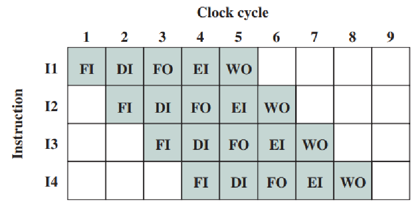
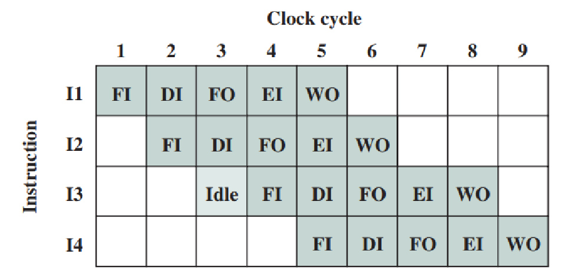
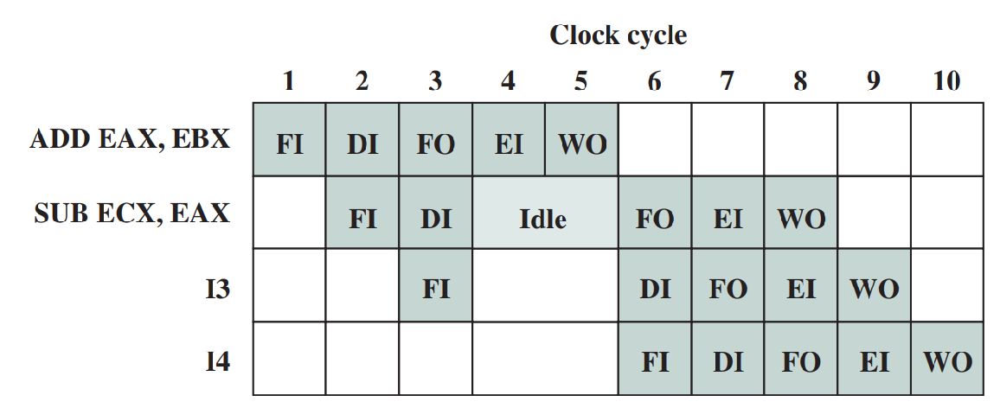
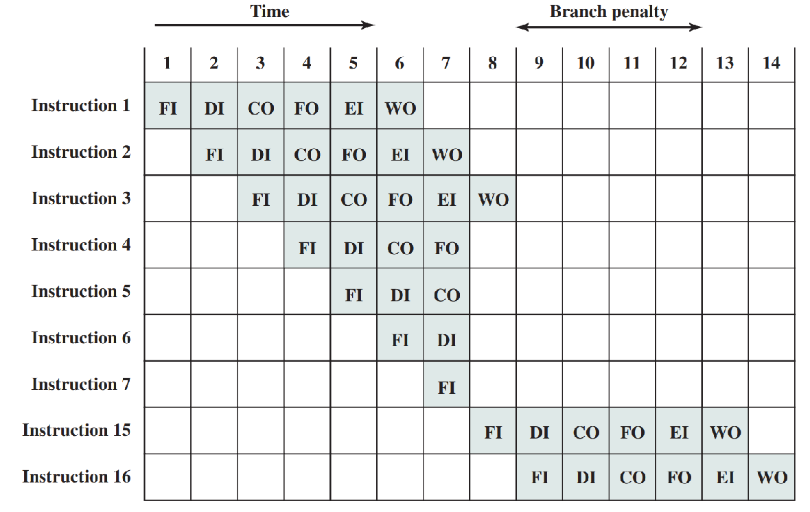

## Processor organization

!!! tip "Processor organization"

    The processor executes instructions via two operations:
    1. Move data from one place to another
    2. Perform data processing through ALU

    The data are stored in registers inside CPU, and operations controlled by **control signals** generated by control units.

!!! tip "Control signals"

    Data movement is controled by control signals, generated by the control unit:

    A movement operation $A \leftarrow B$ requires 2 control signals:
    1. Tell PC to put contnet onto CPU bus
    2. Tell MAR to get value from CPU bus

    Other oerations may require more control signals, such as:
    * ALU operations
    * Read/write external memory

!!! tip "Instruction pipelines"

    Recall the different [FDE **stages**](instructions#fetch-decode-execute) of an instruction. 
    
    We can increase the throughput of the CPU by processing **different stages** of different instructions *simultaneously*, by having different hardware used for each stage, in *one clock cycle*. 

    Ideally, this increases the throughput be 1 instruction per clock cycle ($CPI$).

    Note: [*modern* processors] don't have memory operands, so no CO stage.



### Pipeline hazards

Situations that prevent the next instruction rom entering the pipeline for execution:

!!! info "Resource hazards"

    When two instruction require the same hardware at the same clock cycle.

    Solutions: Dedicated hardware; Separate cache

    !!! eg "Example"
        
        `FI` uses same resource as `FO` (see below image)

        

!!! info "Data hazards"

    Consider instructions $I_1,I_2$ in sequence, occurs when there is dependency of operands. Types of data hazards:
    * **Read after write** (RAW) - $I_1$ writes to a register, and $I_2$ reads from it. (Hazard occurs if read *before* write)
    * **Write after read** (WAR) - $I_1$ reads from a register, and $I_2$ writes to it. (Hazard occurs if write *before* read)
    * **Write after write** (WAW) - $I_1$ writes to a register, and $I_2$ writes to it. (Hazard occurs if $I_2$ writes *before* $I_1$)
    
    *Note: Only RAW occurs in pipeline, others occur in parallel systems (undiscussed)*.

    Solutions: Re-arrange instructions if possible, depending on optimization; Data forwarding

    !!! eg "Example"
    
        `ADD EAX, EBX, EAX` and `SUB ECX, EAX, ECX` (see below image)

        

!!! info "Control hazards"

    When we don't know where to continue until branch instruction is executed. The `FI` stage of next instruction cannot start until branch resolved.

    !!! eg "Example"
        
        

!!! info "Branch prediction"

    A technique to reduce control hazards, by guessing the outcome of a branch instruction. If the guess is correct, no penalty; if wrong, flush the pipeline and restart.


## Reduced Instruction Set Computer (RISC)

!!! tip "Processor performance"
    
     ```math
     \text{Execution Time} = \text{Instruction Count} \times CPI \times \text{Clock Cycle Time}
     ```

     Notes:
     * $\text{Clock cycle time} = \frac{1}{\text{Clock rate}}$

     Ways to improving (reducing) execution time:
     * Simplify instruction set and use *hardwired* logic $\to \text{Clock rate} \Uparrow, \text{Instruction Count} \uparrow$
     * Extensive pipelining $\to \text{CPI} \Downarrow$

     There is overall improvement in performance, as increase in instruction count (and code size) is usually *very small*.

     !!! eg "Improvement when using registers"

        Consider the two set of instructions:

        Without registers:

        ```
        ADD A, B, C
        ADD D, C, F
        ADD B, F, C
        ---
        Memory access count: 9
        ```

        With registers:

        ```
        LD A, R1
        LD B, R2
        ADD R1, R2, R3
        LD D, R4
        ADD R4, R3, R5
        ADD R2, R5, R3
        ST R3, C
        ST R5, D
        ---
        Memory access count: 5 < 9
        ```
        
!!! note "Characteristics of RISC"

    * All instructions are register-register type except LOAD and STORE (which access memory)
    * Fixed length and simple, fixed format instructions.
    * Relatively few operations and addressing modes.
    * Use of instruction pipelining, instruction level parallelism and extensive software and hardware techniques to eliminate pipeline disruption.
    * Rely on optimizing compiler to enhance system performance.
    * Note that these measures mentioned above can be applied to any processor design, and not limited to RISCs.
    * Actually, RISC is a design philosophy where performance of CPU is enhanced.
    * Nothing prevents a CPU designer from incorporating these measures into their CISC (Complex Instruction Set Computer).
    * Nowadays, usually we will see some kind of hybrid design