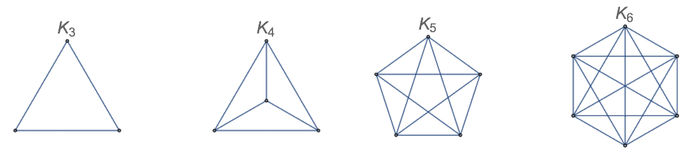
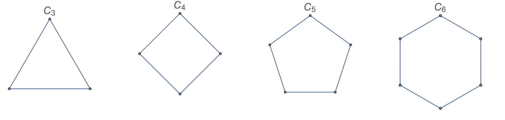
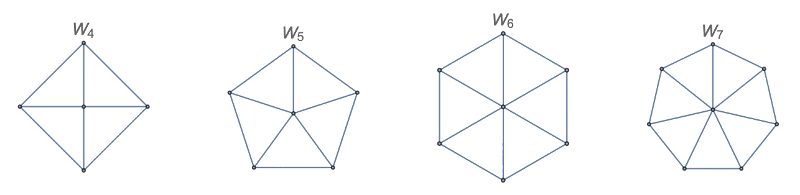
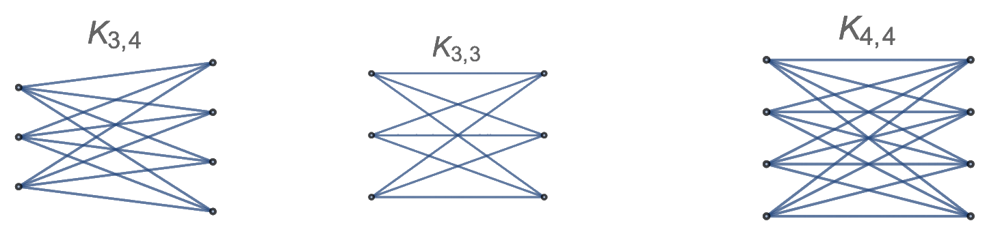
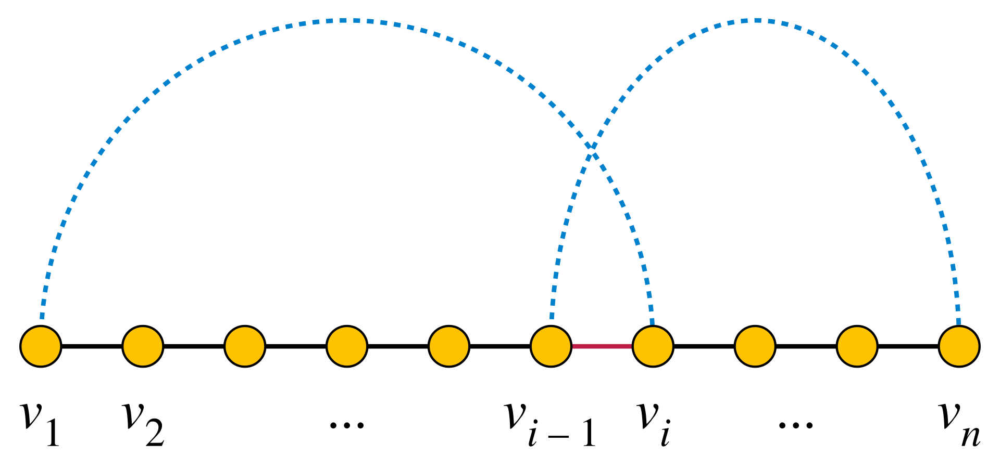

## Introduction

!!! tip "Definition"

    A graph $G = (V,E)$ is represented as a non-empty set of vertices (nodes) $V$ and a set of edges (arrows) $E$. 

    A **directed** edge $E = (u,v)$ is represented as an ordered pair of nodes, referred to as **endpoints**.
    
    A **undirected** (two-way) edge $E=\{u,v\}$ is represented as a set of two nodes. $u$ is the **head** (initial) and $v$ is the **tail** (end) of the edge.

!!! note "Loops"

    A **loop** is an edge that connects a node to itself, for example $G = (\{1\}, \{1,1\})$.

!!! info "Types of graphs"

    | Type | Description | 
    | --- | --- |
    | Multigraphs | Graphs with multiple edges between the same pair of nodes, but no loops |
    | Pseudographs | Multigraphs with loops |
    | Digraphs | Graphs with directed edges |
    | Mixed graphs | Graphs with both directed and undirected edges |
    | Simple | Undirected graphs with no loops and no multiple edges |

    !!! eg "Examples"

        ```javascript
        // Multigraph
        G = (
            {1,2},
            {{1,2}, {1,2}}
        )
        // Pseudograph
        G = (
            {1,2},
            {{1,2}, {1,2}, {1,1}}
        )
        // Digraph
        G = (
            {1,2},
            {(1,2)}
        )
        ```

!!! tip "Neighbourhoods of nodes"

    Nodes connected with one another are **neighbours**.

    The **neighbourhood** $N(v)$ of a node $v$ is the set of all nodes that are directly connected to $v$.

    The **degree** $deg(v)$ of a node $v$ can be identified in one of the following ways:
    * Visually the number of lines drawn from $v$
    * The occurance of $v$ in the items of $E$
    * $|N| + |L(v)|$, where $N$ is the set of neighbours and $L(v)$ is the set of loops that contain $v$


!!! info "Handshaking theorem"

    ```math
    2|E| = \sum_{v \in V} deg(v)
    ```

    This is a direct consequence of the fact that **each edge contributes 2 to the sum of degrees**, as each edge must have two endpoints.

    !!! eg "Proof: Even number of nodes of odd degree"

        An undirect graph has an even number of *nodes that have an odd degree*.

        Let $V_\text{odd}$ be the set of nodes with odd degree, and $V_\text{even} = V \setminus V_\text{odd}$

        ```math
        2|E| = \sum_{v \in V_\text{odd}} deg(v) + \sum_{v \in V_\text{even}} deg(v)
        ```

        1. As each node in $V_\text{even}$ has an even degree, the sum of degrees of all nodes in $V_\text{even}$ is even.
        2. As the LHS is even, the sum of degrees of all nodes in $V_\text{odd}$ must also be even.

    !!! eg "Example application of theorem"

        "9 people greet each other by shaking hands. Is it possible that each person shook hands with exacty 7 other people?"

        Model as $G=(V,E)$, where $V$ is the set of people and $E$ is the set of handshakes. $|V|=9$. By the handshaking theorem, $2|E| = \sum_{v \in V} deg(v) = 9 \times 7 = 63$. 
        
        As both sides must be integers of either odd or even parity, the equation is impossible to satisfy.

## Directed graphs

The following applies in the context of directed graphs.

!!! tip "In-degree and out-degree of nodes in directed graphs"

    The **in-degree** $deg^-(v)$ of a node $v$ is the number of edges that point to $v$.

    The **out-degree** $deg^+(v)$ of a node $v$ is the number of edges that point away from $v$.

    The **degree** $deg(v)$ of a node $v$ is the sum of its in-degree and out-degree.

    ```math
    deg(v) = deg^-(v) + deg^+(v)
    ```

!!! info "Property of degrees in direceted graphs"

    ```math
    \sum_{v \in V} deg^-(v) = \sum_{v \in V} deg^+(v) = |E|
    ```

    This is a direct consequence of the fact that **each edge contributes 1 to the sum of in-degrees and out-degrees**, as each edge must have one head and one tail.


## Special graphs

!!! tip "Complete graph"

    $G=K_n$ is a graph that has all nodes connected to each other. 

    A graph for which there is a pair of nodes that are not connected is called an **incomplete graph**.

    

!!! tip "Cycles"

    $G=C_n$ is a graph of a polygon with $n \geq 3$ sides. This can be expressed as:
    
    ```math
    C_n = (\{1,2,\ldots,n\}, \{(1,2), (2,3), \ldots, (n-1,n), (n,1)\})
    ```

    

!!! tip "Wheels"

    $G=W_n$ is a cycle $C_n$ that has an additional node connected to all nodes in the cycle. (So there are $n+1$ nodes in total.)
    
    

!!! tip "Bipartite graph"

    A **bipartite graph** is a graph that can be divided into two sets of nodes, called a **bipartition** $(V_1, V_2)$, such that no two nodes in the same set are connected.

    A **complete bipartite graph** $K_{m,n}$ is a bipartite graph with $m$ nodes in one set and $n$ nodes in the other set, and all nodes in one set are connected to all nodes in the other set.

    

## Matchings

!!! tip "Matching"

    A matching $M$ is a set of edges such that all nodes are distinct in definition.

    A **perfect matching** is a matching that covers all nodes in the graph.

    A **maximum matching** is a matching that has the largest number of edges.

    !!! eg "Example"

        ```mermaid
        graph LR
            A((A)) --- B((B))
            A --- C((C))
            B --- D((D))
            C --- D

            linkStyle 0 stroke:red,stroke-width:2px
            linkStyle 3 stroke:red,stroke-width:2px
        ```

        For graph with $V=\{A,B,C,D\}$, a possible matching can be $M=\{\{A,B\}\}$. For this graph, the **maximum** and **perfect** matching is $M=\{\{A,B\},\{C,D\}\}$, as this is the maximum number of edges that can be selected without sharing nodes, and all nodes are covered.

!!! note "Perfect matching"

    A matching in a bipartite graph with bipartition $(V_1,V_2)$ is a **perfect matching** if $\{\forall v\in V_1, w\in V_2\} \in M$, or $|M|=|V_1|$.

!!! info "Hall's Marriage Theorem"

    For a [bipartite graph](#bipartite-graph) $G=(V,E)$ with bipartition $(V_1,V_2)$, there exists a **perfect matching** *iff* $|N(W)| \geq |W|$ for all $W \subseteq V_1$. ($N(W)$ is the set of [neighbours](#neighbourhoods-of-nodes) of $W$)

    !!! eg "Example application"
    
        "Suppose a standard deck of cards is dealth out into 13 stacks of 4 cards each. (There are 13 denomintation of 4 suit each, from Ace to King.) Show that it is possible to select exactly 1 card from each stack, such that 13 cards are of one of each denomination." 

        Model the problem as a bipartite graph $G=(V,E)$, where $V_1$ is the **set of denominations**, and $V_2$ is the **set of stacks of 4**. 

        We can assign the cards of stacks by making edges between 4 denominations and the stack of 4 cards. This ensures that $|N(W)| \geq |W|$ for all $W \subseteq V_1$, as each denomination is connected to 4 stacks of cards. 

        In this scenario, the selection of 1 card from each stack, such that all denominations are selected, is equivalent to the existence of **perfect matching** in the bipartite graph.

        Assume the contradiction that there is no perfect matching. Then, by Hall's Marriage Theorem, there exists $W \subseteq V_1$ such that $|N(W)| < |W|$.

        This is a contradiction, as there are 13 denominations and 4 stacks of cards, so $|N(W)| \geq |W|$ for all $W \subseteq V_1$. Therefore, there exists a perfect matching in the bipartite graph.

## Connectivity

!!! tip "Subgraphs"

    A subgraph $G'=(V',E')$ of a graph $G=(V,E)$ is a graph such that $V' \subseteq V$ and $E' \subseteq E$. A **proper subgraph** $G' \neq G$.

    *You can think of subgraphs as a graph that is produced by removing nodes and edges from the original graph.*

    A **induced subgraph** $G'=(V',E')$ is a graph such that $V' \subseteq V$ and $E' = \{(u,v) \in E | u,v \in V'\}$. 

    *You can think of induced subgraphs as a subgraph that is produced by strictly removing nodes from the original graph and only the edges that are connected to the removed nodes.*

!!! tip "Edge contractions"

    Remove an edge $e$ with it's endpoints $u$ and $v$, and merge the nodes to a new node $w$. The new graph is called a **contraction** of the original graph.

    !!! eg "Example"

        ```mermaid
        graph TB
            A((A)) --- B((B))
            A --- C((C))
            B --- D((D))
            C --- D
        
            w((w)) --- E((C))
            w --- F((D))
            E --- F

            linkStyle 0 stroke:red,stroke-width:2px
        ```

        The contraction of edge $AB$ is $G'=(V',E')$, where $V'=\{w,C,D\}$ and $E'=\{\{w,C\},\{w,D\},\{C,D\}\}$.

!!! note "Graph unions"

    The union of two graphs $G_1=(V_1,E_1)$ and $G_2=(V_2,E_2)$ is a graph $G=(V_1 \cup V_2, E_1 \cup E_2)$.

!!! tip "Paths and circuits"

    A **path** is a sequence of edges, $e_1,e_2,\ldots,e_k$, such that $e_i=\{v_i,v_{i+1}\}$ for all $i=1,2,\ldots,k-1$. The length of the path is $k$. 
    
    > The condition for *directed* graphs is that $e_i=(v_i,v_{i+1})$ instead.
    
    Or for *simple* graphs, $v_1,v_2,\ldots,v_k$ such that $(v_i,v_{i+1}) \in E$ for all $i=1,2,\ldots,k-1$.

    A **circuit** is a path that starts and ends at the same node, and has at least 2 nodes.

    Paths and circuits can be classified as **simple** if they do not contain the same <u>edge</u> more than once.

    !!! eg "Example"

        ```mermaid
        graph LR
            A((A)) --- B((B))
            A --- C((C))
            B --- D((D))
            C --- D
            B --- C
        ```

        Consider the above simple graph:
        * $A \to B \to C \to D$ is a simple path of length 3
        * $A \to B \to A$ is a non-simple circuit of length 2
        * $A \to B \to C \to D \to C$ is a non-simple path of length 4
        * $A \to B \to C \to A$ is a simple circuit of length 3

!!! note "Connectedness"

    A graph is **connected** if there is a path between every pair of distinct nodes, else it is **disconnected**.

    > For a *directed* graph, a graph is **strongly connected** if there is a path between every pair of distinct nodes **in both directions**, else it is **weakly connected**.

    A **connected component** is one of the maximal connected subgraphs of a disconnected graph, or just the whole graph if it is connected.

    > For a *directed* graph, a **strongly connected component** is one of the maximal strongly connected subgraphs of a disconnected graph, or just the whole graph if it is strongly connected.

    !!! eg "Example"

        ```mermaid
        graph LR
            A((A)) --- B((B))
            A --- C((C))
            B --- D((D))
            C --- D
            B --- C

            E((E)) --- F((F))
        ```

        Consider above as a singular graph. The graph has two connected components: $G_1=(\{A,B,C,D\},\{AB,AC,BC,BD,CD\})$ and $G_2=(\{E,F\},\{EF\})$. The graph is **disconnected** as there is no path between $G_1$ and $G_2$.

        ```mermaid
        graph TB
            A((A)) --> B((B))
            B --> C((C))
            C --> A
            B --> D((D))
            D --> C

            E((A)) --> F((B))
            F --> G((C))
            G --> E
            H((D)) --> F
            H --> G

            linkStyle 5 stroke:red,stroke-width:2px
            linkStyle 6 stroke:red,stroke-width:2px
            linkStyle 7 stroke:red,stroke-width:2px
        ```

        For the two graphs above, the graph on the left is **weakly connected** as there is a path between every pair of distinct nodes in one direction, but not in the other direction. (e.g. no path from $B \to D$)

        The graph on the right is **strongly connected** as there is a path between every pair of distinct nodes in both directions. 

        For the weakly connected graph, the strongly connected components are $G_1=(\{A,B,C\}, \{(A,B), (B,C), (C,A)\})$ and $G_2=(\{D\}, \{\})$. 
        

!!! info "Cut nodes and edges"

    A **cut node** (articulation point) is a node whose removal increases the number of connected components in the graph.

    A **cut edge** (bridge) is an edge whose removal increases the number of connected components in the graph.

    !!! eg "Example"

        ```mermaid
        graph LR
            A((A)) --- B((B))
            A --- C((C))
            A --- F((F))
            B --- F
            C --- F
            F:::red --- I((I))
            H((H)) --- F
            G((G)) --- F
            H --- G

            linkStyle 5 stroke:red,stroke-width:2px

            classDef red fill:#f00,stroke:#000,stroke-width:2px;
        ```
        
        * Articulation point is $F$, as removing it will disconnect the graph into 3 components. 
        * $FI$ is a bridge, as removing it will disconnect the graph into 2 components.

!!! tip "Connectivities"

    The **node connectivity** $\kappa(G)$ of a graph $G$ is the minimum number of nodes that must be removed to disconnect the graph.

    The **edge connectivity** $\lambda(G)$ of a graph $G$ is the minimum number of edges that must be removed to disconnect the graph.

    For *disconnected* graphs, or graphs with $|V|=1$, $\kappa(G)=\lambda(G)=0$.

!!! info "Property of connectivities"

    ```math
    \forall G: \kappa(G) \leq \lambda(G) \leq \min_{v \in V} deg(v)
    ```

    !!! eg "Proof"

        * $\kappa(G) \leq \min_{v \in V} deg(v)$, as deleting all neighbors of a node $v$ will disconnect the graph to a new component $V=\{v\}$.
        * $\lambda(G) \leq \min_{v \in V} deg(v)$, as deleting all edges of a node $v$ will disconnect the graph to a new component $V=\{v\}$.
        * $\kappa(G) \leq \lambda(G)$, as deleting a bridge will disconnect the graph to a new component, and deleting a cut node will disconnect the graph to a new component.

!!! info "Number of path between vertices"      

    Represent the graph as an adjacency matrix $A$, where $A_{i,j}$ is the number of edges between node $i$ and node $j$. 
    
    The number of paths of length $k$ between nodes $i$ and $j$ is given by the $(i,j)$ entry of the matrix $A^k$.

    !!! eg "Example"

        ```math
        A = \begin{pmatrix}
            0 & 1 & 1 & 0\\
            1 & 0 & 1 & 1\\
            1 & 1 & 0 & 1\\
            0 & 1 & 1 & 0
        \end{pmatrix}
        ```

        The number of paths of length $2$ between nodes $1$ and $3$ is given by the $(1,3)$ entry of the matrix $A^2$:

        ```math
        A^2 = \begin{pmatrix}
            2 & 1 & 2 & 1\\
            1 & 3 & 0 & 2\\
            2 & 0 & 3 & 2\\
            1 & 2 & 2 & 0
        \end{pmatrix}
        ```

        So there are **two** paths of length $2$ between nodes $1$ and $3$. 

### Euler paths

!!! tip "Euler paths and circuits"

    An **Euler path / circuit** is a *simple* path / circuit that contains every edge in $E$.

!!! info "Sufficient and necessary condition for undirect Euler circuits"

    A connected undirected multigraph with $|V| \geq 2$ has an Euler circuit *iff* all nodes have even degree.

    !!! eg "Proof"

        * **Necessary condition**:
            * If a graph has an Euler circuit, then it must be possible to traverse every edge exactly once and return to the starting point. 
            * This means that every time you enter a node, you must also leave it. 
            * Therefore, the degree of each node must be even.
        * **Sufficient condition**: Prove by contradiction:
            * **Base case**: Let $|E|=e=2$. A connected graph can have $|V|\in\{1,2\}$. $|V|=1$ is a loop with $deg(v)=2$, and $|V|=2$ is a circuit with $deg(v)=2\forall v\in V$.
            * **Inductive step**: Assume true for some $|E|\leq k$. For $|E|=k+1$, as the graph is connected, there exists a simple circuit. There are two cases then:
                1. The circuit is the Euler circuit.
                2. The circuit is not the Euler circuit. Remove the paths and exclusive nodes in this circuit. The remaining components by induction are Euler circuits.
                3. Hence, you can build an Euler circuit by travelling through the components while tracing the original circuit.

!!! info "Sufficient and necessary condition for directed Euler circuits"

    ...

!!! info "Necessary and sufficient condition for Euler paths"

    A connected multigraph with $|V| \geq 2$ has an Euler path but **not** an Euler circuit *iff* exactly 2 nodes have odd degree.

    !!! eg "Proof"

        We can prove this from both sides (equivalence):

        * **Direction 1**: Euler path but not Euler circuit $\implies$ two nodes have odd degree
            * If a graph has an Euler path, then it must be possible to traverse every edge exactly once
            * This means that every time you enter a node, you must also leave it, except for the start and end nodes, which you only traverse once.
            * Therefore, the degree of each node must be even, except for the start and end nodes, which must have odd degree.
            * Hence, there are exactly 2 nodes with odd degree.
            * If a graph has 2 nodes with odd degree, then it must be possible to traverse every edge exactly once
        * **Direction 2**: Two nodes have odd degree $\implies$ Euler path but not Euler circuit
            * Suppose $G$ has exactly two vertices that have odd degree, and others having even degree.
            * If we add a edge between the two odd degree vertices, then all vertices will have even degree.
            * Hence, the graph will have an Euler circuit.
            * If we remove the edge, then the two vertices will have odd degree again.
            * Hence, the graph will have an Euler path but not an Euler circuit.

### Hamiltonian paths

!!! tip "Hamiltonian paths and circuits"

    A **Hamiltonian path / circuit** is a *simple* path / circuit that passes through all node in $V$ **exactly once**.

!!! info "Ore's Theorem"

    If $G$ is a *simple* graph with $|V| \geq 3$ and $deg(u) + deg(v) \geq |V|$ for all **nonadjacent** pair of nodes $(u,v)$, then $G$ has a Hamiltonian circuit:

    ```math
    deg(u) + deg(v) \geq |V| \implies \{u,v\} \notin E
    ```

    !!! eg "Proof"

        Assume there exists $G$ that satisfies the condition, but does not have a Hamiltonian circuit.

        Let $G'$ be formed by adding edges to $G$ (keeping $V$ the same), that it <u>will be</u> a Hamiltonian circuit, if we add one more edge to $G'=(V,E')$.

        Let $x,y$ be any nodes that satisfy $\{x,y\} \notin E'$.

        The edges in $G'$ must form a Hamiltonian path $x=v_1,v_2,\ldots,v_n=y$. Hence, adding the edge $\{x,y\}$ to $G'$ will create a Hamiltonian circuit. ($\underbrace{x=v_1,v_2,\ldots,v_n=y}_{\text{Completes the circuit}}$)

        **Observation**: $\forall\ v_i \in V, 2 \leq i \leq n: \{x, v_i\} \in E', \{y, v_{i-1}\} \notin E'$.
        * This is because if $y$ has a connection to a node *preceeding* a node which is connected to $x$, then the circuit will be made: $x,v_i,v_{i+1},\ldots,y,v_{i-1},v_{i-2},\ldots,x$.

            

        The basic restriction $deg(y) \leq |V|-1$ (definition of *simple* graphs) can be extended to be $deg(y) \leq |V|- deg(x)$, as $y$ can only connect to nodes that do not preceed any nodes that have connections to $x$.

        Hence, $deg(x) + deg(y) \leq |V| - 1$, which is a contradiction to the original condition.

## Graph coloring and chromatic number

!!! tip "Coloring"

    Coloring of a *simple* graph is the assignment of colors to each node so that no two adjacent nodes have the same color.

!!! info "Chromatic number" 

    The chromatic number of a graph is the smallest number of colors needed to color it, denoted by $\chi(G)$.
    
    For special graphs:
    * $K_n$ has chromatic number $n$
    * $C_n$ has chromatic number 2 if $n$ is even, and 3 if $n$ is odd
    * $K_{m,n}$ has chromatic number $2$

    Note the following properties:
    * $\chi(G) \leq |V|$ as each node can be assigned a different color
    * Only *edgeless* graphs have $\chi(G) = 1$
    * $\chi(G)(\chi(G)-1) \leq 2|E|$ as there must be at least one edge between two nodes of different colors
    * $\omega(G) \leq \chi(G)$, where $\omega(G)$ is number of nodes in largest complete subgraph (**clique**) of $G$

!!! knBox "Chromatic Number: Algorithms"

    ```math
    \chi(G) = \min\{\chi(G(V,E\cup\{(u,v)\})), \chi(G/uv)\}\text{, for any } \{u,v\} \notin E
    ```

    Where $G/uv$ is the graph obtained by contracting the edge $uv$.

!!! tip "Graph planarity"

    A graph is **planar** if it can be drawn on a plane without any edges crossing, else **non-planar**. Such drawing is called a *planar representation* of the graph.

    !!! eg "Example"

        For example, for $K_4$, only the right representation is planar.

        ```mermaid
        graph TB
            A((A)) --- B((B))
            B --- C
            B --- D
            A --- D((D))
            C --- D
            A --- C((C))

            1((1)) --- 2((2))
            1 --- 3((3))
            1 --- 4((4))
            2 --- 3
            3 --- 4
            2 --- 4
        ```

!!! note "Regions"

    A region is defined as space that is bounded by edges, including the outer space.

!!! info "Euler's formula"

    For a connected, planar, simple graph $G=(V,E)$:

    ```math
    |R|=|E| - |V| + 2
    ```

    Where $R$ is the set of regions in the graph.

!!! info "Corollary"

    For a connected, planar, simple graph $G=(V,E)$ with $|V| \geq 3$, then $e \leq 3|V| - 6$, and $\exists v \in V: deg(v) \leq 5$

    !!! eg "Proof"

        ...

!!! note "Homeomorphic"

    Two graphs are **homeomorphic** if they can be transformed into each other by a series of edge contractions.

!!! info "Kuratowski's theorem"

    A graph is non-planar if and only if it contains a subgraph that is a *homeomorphic* to $K_5$ or $K_{3,3}$.

    General steps to prove planarity / non-planarity:
    1. Identify if we are comparing with $K_5$ or $K_{3,3}$. Notice $K_5: \min(deg(v) \forall v \in V) = 4$, and $K_{3,3}: \min(deg(v) \forall v \in V) = 3$ respectively. You can only produce a subgraph by removing e/v.
    2. Do edge contractions and attempt to produce $K_5$ or $K_{3,3}$.
    3. Identify if the graph is $K_5$ or $K_{3,3}$ by [coloring](#coloring). Recall $\chi(K_5)=5$ and $\chi(K_{3,3})=2$.

    !!! eg "Example"

        ```mermaid
        graph LR
            A((A)) --- B((B))
            B --- C((C))
            C --- E((E))
            E --- H((H))
            H --- G((G))
            G --- F((F))
            F --- D((D))
            D --- A
            A --- H
            B --- D
            C --- G
            F --- E

            linkStyle 9 stroke:red,stroke-width:2px
        ```

        First notice that all nodes have degree 3, so we will attempt to produce $K_{3,3}$. $|V|=8$, and $K_{3,3}$ has $|V|=6$. Therefore, we have to remove 2 nodes, but **keep the degree of the nodes**. We can:
        1. $E\setminus\{B,D\}$
        2. Perform edge contractions on $B$ and $D$

        We can check if the resulting graph is $K_{3,3}$ by coloring:

        ```mermaid
        graph LR
            A((A)):::red --- C((C)):::blue
            C --- E((E)):::red
            E --- H((H)):::blue
            H --- G((G)):::red
            G --- F((F)):::blue
            A --- H
            C --- G
            F --- E
            F --- A

            classDef red fill:#f00,stroke:#000,stroke-width:2px,color:#fff;
            classDef blue fill:#00f,stroke:#000,stroke-width:2px,color:#fff;    
        ```

        This verifies that the resulting graph is $K_{3,3}$, and hence the original graph is non-planar.

