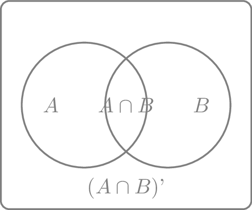

!!! note "Tuples vs. Sets"

    **Tuples** are ordered collections of elements, whereas **sets** are unordered.
    
    For example: $(1,2)$ is different from $(2,1)$, but $\{1,2\}$ is the same as $\{2,1\}$.

!!! info "Set notation"

    | Symbol | Meaning | Example | 
    | --- | --- | --- |
    | $\emptyset$ | Empty set | $\emptyset$ |
    | $U$ | Universal set | Everything | 
    | $\{\emptyset\}$ | Singleton set | $\{\emptyset\}$ |
    | $\{a,b,c\}$ | Set with elements | $\{0,1,2\}$ |
    | $\in$ | Element of | $1 \in \{0,1,2\}$ |
    | $\notin$ | Not an element of | $3 \notin \{0,1,2\}$ |
    | $\subset$ | Subset | $\{0,1\}\subset\{0,1,2\}$ |
    | $\|S\|$ | Cardinality | $\|\{0,1,2\}\| = 3, S=\{a,S\}, \|S\|=2$ |
    | $\cup$ | Union | $\{0,1\}\cup\{1,2\} = \{0,1,2\}$ |
    | $\cap$ | Intersection | $\{0,1\}\cap\{1,2\} = \{1\}$ |
    | $\times$ | Cartesian product | $\{0,1\}\times\{1,2\} = \{(0,1),(0,2),(1,1),(1,2)\}$ |
    | $\setminus$ or $-$ | Set difference | $\{0,1,2\}-\{1\} = \{0,2\}$ |
    | $\overline{S}$ | Complement | $\overline{\{0,1,2\}} = U-\{0,1,2\}$ |
    | $\bigcup_{i=n}^{m} S_i$ | Generalized union (n->m) | $\bigcup_{i=1}^{n}S_i = S_1\cup S_2\cup\ldots\cup S_n$ |
    | $\bigcap_{i=n}^{m} S_i$ | Generalized intersection (n->m) | $\bigcap_{i=1}^{n}S_i = S_1\cap S_2\cap\ldots\cap S_n$ |


!!! tip "Power set"

    $\mathscr{P}(\{1,2\})=\{\emptyset, \{1\}, \{2\}, \{1,2\}\}$
    
    $\|\mathscr{P}(S)\|=2^{\|S\|}$

    Special cases:

    - The power set of the empty set is the set containing the empty set: $\mathscr{P}(\emptyset)=\{\emptyset\}$. 
    - $\mathscr{P}(\mathscr{P}(\emptyset)) = \mathscr{P}(\{\emptyset\}) = \{\emptyset,\{\emptyset\}\}$

!!! tip "Set builder"

    $S=\{x | P(x)\}$ means that $S$ is the set of all $x$ such that $P(x)$ is true.

    For example, $\{x | x \in \mathbb{N}, x < 5\} = \{0,1,2,3,4\}$

!!! note "Number sets"

    | Symbol | Set | Values | 
    | --- | --- | --- |
    | $\mathbb{N}$ | Natural numbers | $0, 1, 2, 3, \ldots$ |
    | $\mathbb{Z}$ | Integers | $\ldots, -2, -1, 0, 1, 2, \ldots$ |
    | $\mathbb{Q}$ | Rational numbers | $\frac{a}{b}$ where $a, b \in \mathbb{Z}$ |
    | $\mathbb{R}$ | Real numbers | $-0.1, \pi, \sqrt{2}$ |
    | $\mathbb{C}$ | Complex numbers | $a + bi$ where $a, b \in \mathbb{R}$ |

### Venn Diagrams

<div className="w-full flex gap-4 flex-wrap md:flex-nowrap">
<div >
Venn diagrams illustrate concepts like intersections, unions, which is a good way to visualize probabilities. The overlapping regions indicate elements that belong to multiple sets, while non-overlapping regions represent elements unique to specific sets.

In this example, two circles are drawn to represent sets A and B. The overlapping region is labeled as the intersection of sets A and B, denoted by A $\cap$ B.
</div>
<div className="lg:min-w-72 md:min-w-60 w-60">



</div>
</div>

## Relations

!!! tip "Definition of relations"

    For an arbitrary **relation** $R$ on two sets $A$ and $B$, it must be a subset of the Cartesian product $A \times B$:

    ```math
    R \subseteq A \times B
    ```

    Where the relation describes some relation between the elements of the sets.

    We can denote a relationship between two elements $a \in A$ and $b \in B$ as $aRb \equiv (a,b) \in R$, and $a\not{R}b \equiv (a,b) \notin R$.

    Hence, a **relation on a single set** is a subset of the Cartesian product $A \times A$.

    !!! eg "Example"

        Consider $R$ describes the relation where $\{(a,b) | a \text{ divides }b\}$. For $A = \{2, 6\}$:

        ```math
        R = \{(2,2), (2,6), (6,6)\} \subset A \times A
        ```

!!! tip "Properties of relations"

    | Property | Definition | Example $A=\{1,2,3\}, R=$ |
    | --- | --- | --- |
    | Reflexive | $(a,a) \in R\ \forall\ a \in A$ | $\{(1,1), (2,2)\}$ |
    | Symmetric | $(a,b) \in R \Rightarrow (b,a) \in R$ | $\{(1,2), (2,1)\}$ |
    | Anti-symmetric | $(a,b) \in R \land (b,a) \in R \Rightarrow a=b$ | $\{(1,2)\} \| \{(1,1), (2,3)\}$ |
    | Transitive | $(a,b) \in R \land (b,c) \in R \Rightarrow (a,c) \in R$ | $\{(1,2), (2,3), (1,3)\}$ |

    A $\emptyset$ relation has all the above properties.

!!! info "Equivalence relations"

    A relation is said to be **equivalence** if it is reflexive, symmetric, and transitive.

!!! info "Equivalence class"

    The set of all elements related to a given element $a$ is called the **equivalence class** of $a$, given by:

    ```math
    [a] = \{x | x \in A, (a,x) \in R\}
    ```

    !!! eg "Example"

        Consider $R = \{(1,1), (1,2), (2,1), (2,2), (3,3)\}$:

        ```math
        [1] = \{1,2\}, [2] = \{1,2\}, [3] = \{3\}
        ```

!!! info "Composition of relations"

    The **composition** of two relations $R$ and $S$ is defined as:

    ```math
    R \circ S = \{(a,c) | \exists b \in B \text{ such that } (a,b) \in R \land (b,c) \in S\}
    ```

    !!! eg "Example"
    
        Consider $R = \{(1,2), (2,3)\}$ and $S = \{(2,3), (3,4), (5,5)\}$:

        ```math
        R \circ S = \{(1,3), (2,4)\}
        ```

        We leave out the pair $(5,5)$ as it does not have a corresponding pair in $R$.

### Visualization of relations

!!! info "Directed graphs"

    A graph where:

    - Each node represents an element of the set
    - Arrow from node $a$ to node $b$ exists if $(a,b)$ is in the relation

    !!! eg "Example"

        Consider $R = \{(1,2), (2,3), (3,1)\}$:

        ```
        1 -> 2 -> 3
        ^         |
        |_________|
        ```

!!! info "Adjacency matrix"

    A matrix representation of a relation where:

    - Rows and columns represent elements of the set
    - A cell $(row,col)$ is 1 if $(a,b)$ is in the relation, 0 otherwise

    !!! eg "Example"

        Consider $R = \{(1,2), (2,3), (3,1)\}$:

        ```
            0 1 0
        M = 0 0 1
            1 0 0
        ```

!!! info "Adjaceny matrix and property of relations"

    | Property | Adjacency matrix |
    | --- | --- |
    | Reflexive | Diagonal elements are 1 |
    | Symmetric | Symmetric across the diagonal |
    | Anti-symmetric | No symmetric 1-pairs across the diagonal | 
    | Transitive | Square of the matrix is equal to the original matrix |