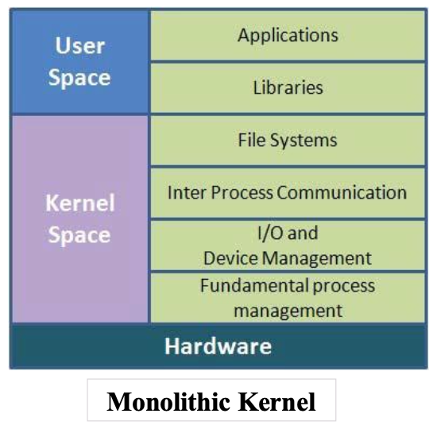
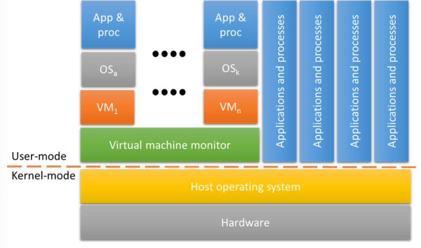
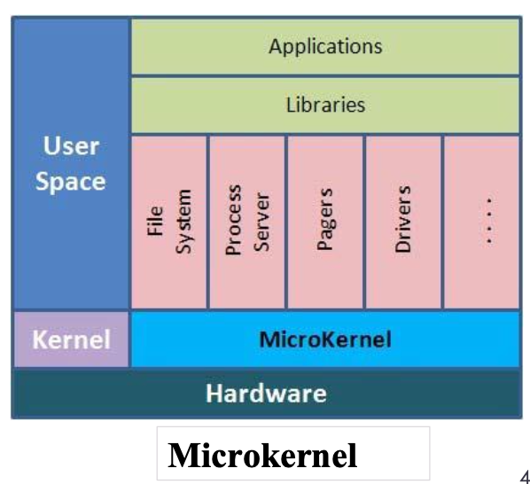

!!! note "Operating System Structure"

    1. **Command Layer** : User interface for interacting with the OS.
    2. **Service Layer** : Utility functions used by applications and the commandd layer.
    3. **Kernel** : Core of the OS that manages resources and interacts directly with hardware.

!!! info "User mode v.s. Kernel mode"
    1. **Kernel Mode** (Privileged / Supervisor Mode)
        - Used when the OS kernel executes.
        - Operates at the _highest_ privilege level, allowing execution of all machine instructions.

    2. User Mode
        - Used when user applications executes.
        - Operates at a _lower_ privilege level with restricted access to machine instructions.

!!! note "System call"
    - Mechanisms allowing application to request OS resources or services.

    - Role : Serve as the APU for OS services

    - When a system call is made, the **system switches** from user mode to kernel mode and exeectes the requested kernel function 

## Common architectures 
1. Monolithic Architecture
2. Layered Architecture
3. Microkernel Architecture
4. Modular Approach

!!! note "Monolithic Architecture"
    - All OS components are contained within the kernel
    
    Advantages : 
    - **highly efficent** due to direct interact

    Disadvantages : 
    - Architecture-dependent code is spread throughout the kernel
    - Components can directly access each other's data and functions, increasing the risk of bugs
    
    

!!! note "Layered Architecture"
    - Groups components by function into modules, layered one on top of another, with communication restricted to adjacent layers

    Advantages :
    - Simplifies construction and debugging
    - **Supports information hiding**

    Disadvantages :
    - Poor performance due to restructed communication.
    - Difficult to define and order layers.
    - Lacks flexibility

    

!!! note "Microkernel Architecture"
    - Moves most functionalities from the kernel to user-space processes, reducing the kernel to basic process communication and I/O control.

    Advantages :
    - Extensible, portable, and scalable.
    - Mor secure and reliable ( less code running in kernel mode)

    Disadvantages : 
    - Poor performance due to message-based communication overhead through the kernel

    

!!! note "Modular Approach"
    - Implements core components as separate modules within the kernel ( similar to layered architecture )

    Advantages : 
    - Well-defined, protected interfaces for each module.
    - Efficient communication within the kernel.
    - Supports dynamic loading of features as needed.
    - Extensible, allowing easy modification or addition of modules.