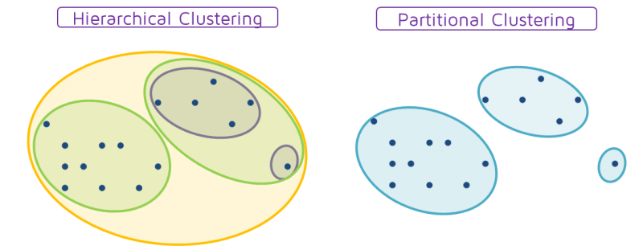

!!! info "Cluster Analysis"
    Finding groups of objects which will be similar to one another and different from the objects in other groups

!!! note "Types of Clustering"
    A clustering = a set of clusters

    There are two types of clustering 
    1. **Partitional Clustering**
        - A division data objects into non-overlapping sybsets such that each data object is in exactly one subset

    2. **Hierarchical clustering**
        - A set of nested clusters organized as a hierarchical tree

    

There are two type of **Clustering Algorithms**
    1. K-means
    2. Hierarchical clustering

!!! note "K-means Clustering"
    