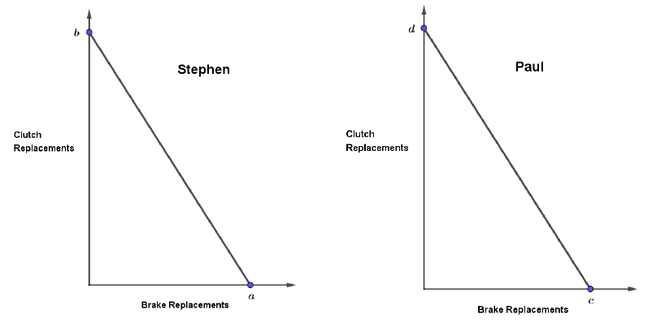

Modifications from 2025 Spring Quiz.

## 2025 Spring Quiz 2 Q1

The following table shows the amount of resources (in man-hours) required to produce good A or good B in Oceanland and Funland, respectively.

| | A | B | 
| --- | --- | --- | 
| Oceanland | X | 12 |
| Funland | 7 | 21 | 

If Oceanland has a comparative advantage in producing A, then, the maximum value of X should be strictly smaller than \[Answer\].

<Collapsible title="Solution">

```math
\begin{align*}
    OC_{O,A} &=\frac{X}{12} \\
    OC_{F,A} &=\frac{7}{21} = \frac{1}{3} \\
    OC_{O,A} &< OC_{F,A}\\
    \frac{X}{12} &< \frac{1}{3} \\
    X &< \underline{\mathbf{4}}
\end{align*}
```

</Collapsible>

## 2021 Fall Midterm Q8 Modified

In a closed economy, Ann and Bruce shall make their production and consumption decisions together.  Ann can produce either 5 kg Fish or 4.5 kg Mushroom per day.  Bruce can produce either 6 kg Fish or 17.4 kg Mushroom per day.  Suppose they decide to consume the two goods at a ratio of 1:1.  Ann and Bruce will consume a total of  \[Answer\] kg Fish per day.

<Collapsible title="Solution">

We find the intersection of 

```math
\begin{align*}
    \text{PPC formula: }G_1 &= (-OC_2) \cdot G_2 + c\\
    OC_{A,M} &= \frac{5}{4.5}\text{ count formula} \approx 1.11\\
    OC_{B,M} &= \frac{6}{17.4}\text{ count formula} \approx 0.34\\
    \\
    PPC_A &\rightarrow F = -\frac{5}{4.5} \cdot M + 5\\
    PPC_B &\rightarrow F = -\frac{6}{17.4} \cdot M + 6\\
    PPC_\text{c} &\rightarrow F = M\\
\end{align*}
```

$\because OC_{A,M} > OC_{B,M}$ $\therefore$ We need to shift $PPC_A$ to the right, and $PPC_B$ upwards, as to maximize efficiency of production.


```math
\begin{align*} 
    PPC_{AB,A} &\rightarrow F = -\frac{5}{4.5} \cdot (M - \frac{6*17.4}{6}) + 5\\
    PPC_{AB,B} &\rightarrow F = -\frac{6}{17.4} \cdot M + 6 + 5\\
    \text{Intersection: }  PPC_{AB,A} \& PPC_c \rightarrow F &= -\frac{5}{4.5} \cdot (F - \frac{6*17.4}{6}) + 5\\
    F&=11.53\\
    \text{Intersection: }  PPC_{AB,B} \& PPC_c \rightarrow F &= -\frac{6}{17.4} \cdot F + 6 + 5\\
    F&=8.18\\
    8.18 < 11.53 \implies F &= \underline{\mathbf{8.18}}
\end{align*}
```

</Collapsible>

## 2025 Spring Quiz 2 Q3

In Islandia, a small economy, Jack and Jill shall make their production and consumption decisions together.  Jack can produce either 8 kg banana or 14.4 kg tea per day.  Jill can produce either 9 kg banana or 19.8 kg tea per day.  Suppose now they are open to trade with the rest of the world.  The price of banana is \$2/kg and the price of tea is \$1/kg in the world market.  Suppose Islandia is small enough that its behavior will not affect the world prices.

If they are going to consume 7 kg banana, then, they will end up consuming a total of  \[Answer\] kg tea.

<Collapsible title="Solution">

First check specialization:

```math
\begin{align*}
    OC_{\text{Jack},B} &= \frac{14.4}{8} = 1.8\\
    OC_{\text{Jill},B} &= \frac{19.8}{9} = 2.2\\
\end{align*}
```

$\because 1.8 < 2 < 2.2 \implies $ Jack will specialize in producing B, and Jill will specialize in producing T.

```math
\begin{align*}
    \text{Total B production by Jack: } 8\\
    \text{World TOT: T per B: } 2\\
    \text{T consumption using profit by Jack: } (8-7) \times 2 = 2\\
    \text{Total T production by Jill: } 19.8\\
    \text{Total T consumption: } 19.8 + 2 = \underline{\mathbf{21.8}}
\end{align*}
```

</Collapsible>

## 2021 Summer Midterm Q13 Modified

The United Kingdom and Germany trade cars and trucks. The United Kingdom can produce one car with 50 man hours, and one truck with 244 man hours. Germany can produce one car with 32 man hours, and one truck with 123 man hours. You are on the United Kingdom team bargaining over the terms of trade under a new trade deal.

You inform your team that the best terms of trade the UK can reasonably ask for are \[A1\] cars per truck and the worst terms of trade the UK can accept are \[A2\] cars per truck.

<Collapsible title="Solution">

Admissible $TOT \in \{\min\{OC\},\max\{OC\}\}$

```math
\begin{align*}
    OC_{UK,T} &= \frac{244}{50} = 4.88\ (C\text{ per }T)\\
    OC_{G,T} &= \frac{123}{32} = 3.84\ (C\text{ per }T)\\
\end{align*}
```

Best TOT for UK would be the lowest C per T $A1 = \underline{\mathbf{3.84}}$, and the worst TOT for UK would be the highest C per T $A2 = \underline{\mathbf{4.88}}$.

</Collapsible>

## 2022 Spring Midterm Q13 Modified

Simon, Jacky, Matthew, Raymond and Winnie can produce hats and ties. The table below shows their time required to produce a hat and their time required to produce a tie (in minutes).


|          | Minutes per hat | Minutes per tie |
|----------|------------------|-----------------|
| Simon    | 8                | 6.71            |
| Jacky    | 16               | 10.42           |
| Matthew  | 17               | 17.45           |
| Raymond  | 15               | 13.54           |
| Winnie   | 3                | 3.43            |

Assume each of them works 13 hours per day. If we let the three people with the lowest opportunity cost in producing hats to specialize in the production of hats, and the rest to produce ties, we will have a total of \[A1\] hats in a day and \[A2\] ties in a day. (Assume that production quantity can take non-integer values.)

<Collapsible title="Solution">

```math
\begin{align*}
    OC_{S,H} &= \frac{8}{6.71} \approx 1.19\\
    OC_{J,H} &= \frac{16}{10.42} \approx 1.54\\
    OC_{M,H} &= \frac{17}{17.45} \approx 0.97\\
    OC_{R,H} &= \frac{15}{13.54} \approx 1.11\\
    OC_{W,H} &= \frac{3}{3.43} \approx 0.87\\
    \therefore OC_{J,H} > OC_{S,H} > OC_{R,H}& > OC_{W,H} > OC_{M,H}\\
    N_{H} &= (\frac{1}{17} + \frac{1}{15} + \frac{1}{3})\times(13\times60) =  \underline{\mathbf{357.88}}\\
    N_{T} &= (\frac{1}{6.71} + \frac{1}{10.42})\times(13\times60) =  \underline{\mathbf{191.10}}
\end{align*}
```

</Collapsible>

## 2022 Spring Final Q8 Modified

Clara, Kant, and Leo can produce hats and ties. The table below shows their time required to produce a hat and their time required to produce a tie (in minutes).

|        | Minutes per hat | Minutes per tie |
|--------|------------------|-----------------|
| Clara  | 13               | 9.65            |
| Kant   | 15               | 13.54           |
| Leo    | 7                | 25.33           |

Assume each of them works 10.5 hours per day. If they decide to jointly produce a total of 69 hats, they can produce a maximum of \[A1\] ties in a day. (Assume that production quantity can take non-integer values.)

<Collapsible title="Solution">

First figure out the specialization by comparative advantage (opportunity cost).

```math
\begin{align*}
    OC_{C,H} &= \frac{13}{9.65} \approx 1.35\\
    OC_{K,H} &= \frac{15}{13.54} \approx 1.11\\
    OC_{L,H} &= \frac{7}{25.33} \approx 0.28\\
\end{align*}
```

$\therefore OC_{L,H} < OC_{K,H} < OC_{C,H}$. Iterate through persons to produce hats, to find the number of hours each person have left to produce ties.

```math
\begin{align*}
    N_{L,H} &= \frac{10.5\times60}{7} = 90 > 69\\
    \text{Time left for H after making H} &= 10.5\times60 - 69\times7 = 147\\
    N_{L,T} &= \frac{147}{25.33}
\end{align*}
```

Others will specialize only in producing ties The resulting amount of ties is:
```math
N_T = \frac{147}{25.33} + \frac{10.5\times60}{13.54} + \frac{10.5\times60}{9.65} = \underline{\mathbf{117.62}}
```

</Collapsible>

## 2023 Summer Midterm Q15 Modified

Adolph, Ben, Clara, Desmond, and Eric can produce hats and ties. The table below shows the number of hats and the number of ties that can be produced in an hour by each of them:

|         | Hats per hour | Ties per hour |
|---------|----------------|---------------|
| Adolph  | 6.29           | 10            |
| Ben     | 12             | 13.99         |
| Clara   | 7.45           | 14.64         |
| Desmond | 6.62           | 5.16          |
| Eric    | 5              | 2.5           |

Assume each of them works 10 hours per day. If we let the two people with the lowest opportunity cost in producing hats to specialize in the production of hats, and the rest to produce ties, we will have a total of \[A2\] hats in a day and \[A3\] ties in a day.

<Collapsible title="Solution">

```math
\begin{align*}
    OC_{A,H} &= \frac{10}{6.29} \approx 1.59\\
    OC_{B,H} &= \frac{13.99}{12} \approx 1.17\\
    OC_{C,H} &= \frac{14.64}{7.45} \approx 1.97\\
    OC_{D,H} &= \frac{5.16}{6.62} \approx 0.78\\
    OC_{E,H} &= \frac{2.5}{5} = 0.5\\
\end{align*}
```

$\therefore OC_{E,H} < OC_{D,H} < OC_{B,H} < OC_{A,H} < OC_{C,H}$. E and D will produce hats, and the rest will produce ties.

```math
\begin{align*}
    N_H &= (6.62 + 5)\times10 = \underline{\mathbf{116.2}}\\
    N_T &= (10 + 13.99 + 14.64)\times10 = \underline{\mathbf{386.3}}\\
\end{align*}
```

</Collapsible>

## 2022 Spring Final Q6-7 Modified

Consider the following individual production possibilities curves for Stephen and Paul to perform clutch and brake replacements (not drawn to scale), where a = 250, b = 500, c = 250, d = 125.


(a) If one standard maintenance service includes one clutch replacement and two brake replacements, if they work separately, they can perform in total \[A1\] standard maintenance services (can be non-integer).

(b) Continue with the previous question, if they work together, they perform in total \[A2\] PERCENT MORE standard maintenance services than working separately.

<Collapsible title="Solution">

Use PPC to find each intersection with constraint of consumption.

```math
\begin{align*}
    PPC_S \rightarrow C &= -\frac{500}{250} \cdot B + 500\\
    & = -2C + 500\\
    PPC_P \rightarrow C &= -\frac{125}{250} \cdot B + 125\\
    & = -0.5C + 125\\
    PPC_c \rightarrow C &= 0.5B\quad\text{(One brakes gives 0.5 clutch)}\\
    \text{Intersection: } PPC_S\ \&\ PPC_c \rightarrow C &= -4C + 500\\
    C &= 100\\
    \text{Intersection: } PPC_P\ \&\ PPC_c \rightarrow C &= -C + 125\\
    C &= 62.5\\
    \text{Total services: } 100 + 62.5 &= \underline{\mathbf{162.5}}
\end{align*}
```

Find joint PPCs and smallest intersection of the two, and then the percentage change. Joint PPCs passes through:
```math
\begin{align*}
    OC_{S,B} &> OC_{P,B} \implies PPC_P \text{ shifts up}\\
    P_1 &= (0, 125+500) = (0, 625)\\
    P_2 &= (250, 500)\\
    P_3 &= (250+250, 0) = (500, 0)\\
    PPC_{SP,P} &\rightarrow \frac{C-625}{B} = -0.5\\
    & C = -0.5B + 625\\
    PPC_{SP,S} &\rightarrow \frac{C}{B-500} = -2\\
    & C = -2B + 1000\\
    \text{Intersection: } PPC_{SP,P}\ \&\ PPC_c \rightarrow C &= -C + 625\\
    C &= 312.5\\
    \text{Intersection: } PPC_{SP,S}\ \&\ PPC_c \rightarrow C &= -4C + 1000\\
    C &= 200\\
    \text{Total services: } &200 \text{ (take smallest intersection)}\\
    \text{Percentage change: } &\frac{200-162.5}{162.5} \times 100 = \underline{\mathbf{23.08\%}}
\end{align*}
```

</Collapsible>

## 2021 Summer Midterm Q10-12 Modified

Robinson and Friday are the only people on Despair, a small island. They can both produce grain and meat. Let G denote the quantity of grain, and M denote the quantity of meat. The following equations summarize their production possibility curves (PPCs) per week.

|         | Production Possibility Curve (PPC) |
|---------|------------------------------------|
| Robinson| G = 21 − 7M                        |
| Friday  | G = 144 − 8M                       |

(a) Suppose Despair is a closed economy. If Robinson and Friday would like to jointly consume 16 units of meat per week, they would be able to jointly consume a maximum of \[A1\] units of grain per week.

<Collapsible title="Solution">

```math
\begin{align*}
    OC_{R,M} &= 7, OC_{F,M} = 8\\
    OC_{F,M} &> OC_{R,M} \implies PPC_R \text{ shifts up}\\
    P_1 &= (0, 21 + 144) = (0, 165)\\
    P_2 &= (\frac{21}{7}, 144) = (3, 144)\\
    P_3 &= (\frac{144}{8}+3, 0) = (21, 0)\\
    M &= 16 \text{ lies on line between } P_2 \text{ and } P_3\\
    \text{Line }\rightarrow \frac{G}{M-21} &= -8\\
    G &= -8M + 168\\
    G &= -16 \times 8 + 168 = \underline{\mathbf{40}}
\end{align*}
```

</Collapsible>

(b) In this closed economy, any admissible terms of trade between Robinson and Friday have to be larger than \[A2\] units of grain per unit of meat and smaller than \[A3\] units of grain per unit of meat.

<Collapsible title="Solution">

Recall that admissible $TOT \in \{\min\{OC\},\max\{OC\}\}$:

```math
TOT \in \{\underline{\mathbf{7,8}}\}\ (G\text{ per }M)
```

</Collapsible>

(c) Suppose Despair is now opened up to trade with the rest of the world, and can trade at world terms of trade of 9.5 units of grain per unit of meat. If Robinson and Friday would like to jointly consume 16 units of meat per week, they would be able to jointly consume a maximum of \[A4\] units of grain per week.

<Collapsible title="Solution">

Specialization of world TOT: $\because 7,8<9.5 \implies$ both will specialize in producing meat (and consume grain from world).

```math
\begin{align*}
    \text{Total M production: } \frac{21}{7} + \frac{144}{8} &= 21\\
    \text{G consumption using profit: } (21-16) \times 9.5 &= \underline{\mathbf{47.5}}
\end{align*}
```

</Collapsible>

## 2022 Spring Midterm Q12

The following graph shows Neverland’s production possibilities, where the coordinates are:

| Point | Tea | Banana |
|-------|-----|--------|
| A     | 0   | 157    |
| B     | 70  | 80     |
| C     | 108 | 0      |

Neverland is a small open economy. Suppose the world price of tea is \$3 per kg, and the world price of banana is \$Z per kg. Given these world prices, Neverland chooses to produce at point B. Based on this information, we can infer that Z is at least \[A1\] and at most \[A2\].

<Collapsible title="Solution">

For Neverland to choose to produce at pt B, the income at that point must be higher than that of the others. 

```math
\begin{align*}
    I_A &= 0 \times 3 + 157 \times Z = 157Z\\
    I_B &= 70 \times 3 + 80 \times Z = 210 + 80Z\\
    I_C &= 108 \times 3 + 0 \times Z = 324\\
    \\
    157Z &< 210 + 80Z \rightarrow Z < \underline{\mathbf{2.73}}\\
    324 &< 210 + 80Z \rightarrow Z > \underline{\mathbf{1.43}}\\
\end{align*}
```

</Collapsible>

## 2022 Fall Final Q4-6 Modified

Cindy and Veronica constitute a small economy that produces only two goods: tea and cakes. We know that Cindy has the comparative advantage in producing tea and Veronica has the comparative advantage in producing cakes. If they fully specialize in the production that they have comparative advantage in, they will produce a total of 102 kgs of tea and 71 kgs of cakes per week.

(a) If the admissible range for terms of trade is between 0.5 kgs of tea per kg of cakes and 3 kgs of tea per kg of cakes, we can infer that Cindy can produce \[A1\] kgs of cakes per week and Veronica can produce \[A2\] kgs of tea per week.

<Collapsible title="Solution">


|         | Tea per week | Cake per week |
|---------|---------------|---------------|
| C (Tea)   | a             | A1             |
| V (Cake)| A2             | b             |

Because C specializes in Tea, and V specializes in Cake, a=102, b=71.

We know $OC_{C,\text{Cake}} > OC_{V,\text{Cake}}$ by given speicalization.

Admissible TOT $\in \{OC_{C,\text{Tea}}, OC_{V,\text{Tea}}\}$. 

```math
\begin{align*}
    TOT &\in \{3, 0.5\}\ (\text{Tea per Cake})\\
    OC_{C,\text{Cake}} = \frac{a}{A1} &= 3\\
    A1 &= \frac{102}{3} = \underline{\mathbf{34}}\\
    OC_{V,\text{Tea}} = \frac{A2}{b} &= 0.5\\
    A2 &= 71\times0.5 = \underline{\mathbf{35.5}}
\end{align*}
```

</Collapsible>

(b) Continue from the previous question. Suppose this small economy opens up its trade with the rest of the world. The world prices are \$1 per kg of tea and \$X per kg of cakes. If both Cindy and Veronica will specialize in the production of tea only, we may infer that X is

\[A2\]: smaller / larger

than \[A3\].

<Collapsible title="Solution">

World Tea per Cake $= \frac{X}{1} = X$. (Tea per Cake gives $OC_\text{Cake}$) 

For them to produce tea only: 
```math
\begin{align*}
    OC_{W,\text{Cake}}&<\min\{OC_{C,\text{Cake}}, OC_{V,\text{Cake}}\}\\
    OC_{W,\text{Cake}}&<0.5\\
    X&\underline{\mathbf{<0.5}}
\end{align*}
```

</Collapsible>

(c) Continue from the previous two questions. Suppose the world price of tea remains \$1 per kg but the price of cakes is \$2 per kg. If Cindy and Veronica together decide to consume tea and cakes at the ratio of 1.7:1 (i.e., for each 1 kg of cakes, they would want to consume 1.7 kgs of tea), they will consume \[A4\] kgs of tea and \[A5\] kgs of cakes per week.

<Collapsible title="Solution">

Given $X=2$, specialization is the same as provided by question.

```math
\begin{align*}
    \text{Total value of production: } 102 \times 1 + 71 \times 2 & = 244\\
    \text{Consumption ratio: } 1.7C &= T\\
    \text{Consumption: } T + 2C &= 244\\
    T + 2\frac{T}{1.7} &= 244\\
    T &= \underline{\mathbf{112.11}}\\
    C &= \frac{244-112.11}{2} = \underline{\mathbf{65.95}}
\end{align*}
```

</Collapsible>