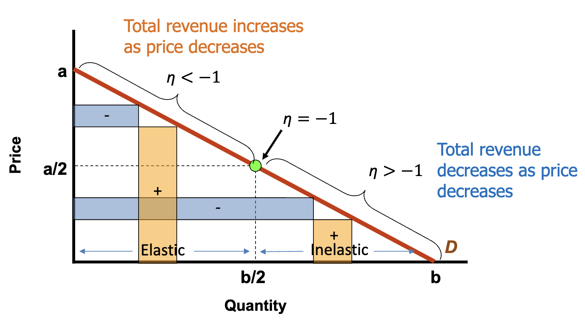

## Price elasticity of demand

!!! note "PED Definition"
    
    The **price elasticity of demand** $\eta_d$ is a measure of responsiveness of quantity demanded to a change in price.

    ```math
    \eta_d = \frac{\% \Delta Q}{\% \Delta P}
    ```

    - $\eta < -1$: **elastic**.
    - $\eta > -1$: **inelastic**.
    - $\eta = -1$: **unit elastic**.
    - $\eta = 0$: **perfectly inelastic**.
    - $\eta = -\infty$: **perfectly elastic**.

!!! tip "Formulas"

    **Midpoint formula**    When two points $(Q_0, P_0)$ and $(Q_1, P_1)$ are given:
    ```math
    \eta = \frac{(Q_1-Q_0)(P_0+P_1)}{(Q_0+Q_1)(P_1-P_0)}
    ```

    **Point formula**    When the curve and a point (P, Q) are given, where $Q_x$ is the x-intercept and $P_y$ is the y-intercept:
    
    ```math
    \eta = \frac{P}{Q}\times\frac{1}{\text{Slope}} = -\frac{PQ_x}{QP_y}
    ```

    These formulas are the same for the [price elasticity of supply](#pes-definition).
    

!!! info "Linear demand elasticity observations"

    Consider the **mid-point** $M = (Q_m, P_m) = (\frac{Q_x}2, \frac{P_y}2)$ of a linear demand curve:

    - $P > P_m\to\eta_d < -1$ (elastic).
    - $P < P_m\to\eta_d > -1$ (inelastic).

    Consider two curves, the **flatter** curve is more elastic **when P is at a common point** of the two curves.

!!! tip "Total revenue"

    **Total revenue** is the product of price and quantity:
    ```math
    PQ \text{ (total revenue)} = P \times Q
    ```
    Therefore, it is also the **area of the rectangle** formed by the price and quantity to the axes.

    Total revenue is **maximized** at the **midpoint** on a linear demand curve.

!!! info "Elasticity, price change and revenue"

    The effects of price change to the revenue $PQ$ is affected by the elasticity of demand:

    | Demand elasticity | $P\uparrow$ | $P\downarrow$ | 
    | --- | --- | --- |
    | Elastic | $P\uparrow \times Q\Downarrow = PQ\downarrow$ | $P\downarrow \times Q\Uparrow = PQ\uparrow$ |
    | Inelastic | $P\uparrow \times Q\Uparrow = PQ\uparrow$ | $P\downarrow \times Q\Downarrow = PQ\downarrow$ |

    Where the arrows indicate the direction and magnitude of change. The comparison of magnitude can be visualized by overlaps of the $PQ$ rectangles as well.

    

!!! info "Unitary elasticity demand curve"

    **Unitary elastic** means that $PQ = \text{constant}$, and hence the total revenue is constant at every point. The price elasticity **equals -1** at every point.

    If given an equation in the following form:

    ```math
    \ln Q = a + b \ln P
    ```
    The price elasticity is always $b$.

    !!! eg "Example"

        If John would purchase \$10 of a good regardless of the price, then $\eta_d = -1$, and the revenue is constant at \$10.

!!! tip "Determinants of the Price Elasticity of Demand"

    | Determinants (increase) | Elasticity | Explaination |
    | --- | --- | --- |
    | Substitutes | + | Switching when price change is easier |
    | Time horizon | + | More time to adjust and find substitutes |
    | Specificity of classification | + | More specific goods are easier to find substitutes |
    | Nature of good (luxurious) | + | Necessities have inelastic demand |
    | Price | + | Higher price goods have more elastic demand |

## Other elasticities of demand for goods

!!! tip "Income elasticity of demand"

    Measures sensitivity of $\Delta Q_d$ to $\Delta I$:

    ```math
    \eta = \frac{I}{Q} \times \frac{\Delta Q}{\Delta I}
    ```

    The value of income elasticity of demand can [deduce the type of good](supply-and-demand/#type-characteristics).

!!! tip "Cross-price elasticity of demand"

    Measures sensitivity of $\Delta Q_d$ of good A to $\Delta P$ of good B:

    ```math
    \eta = \frac{P_B}{Q_A} \times \frac{\Delta Q_A}{\Delta P_B}
    ```

    The value of cross-price elasticity of demand can [deduce the relationship between goods](supply-and-demand/#comparative-characteristics).

Questions might give you a demand relation for two goods, and asks for the above elasticities. They are in the form of:

```math
Q_A = c - \frac{\Delta Q_A}{\Delta P_A}P_A + \frac{\Delta Q_A}{\Delta P_B}P_B + \frac{\Delta Q_A}{\Delta I}I
```

If the quantities are under logarithm, the elasticity is the coefficient of the price, income or cross-price term.

<Collapsible title="Example usage">

Given the demand for good $x$ and $y$ satefies the following relation:

```math
\ln Q_x = 19 - 2.4 \ln P_x - 1.3\ln P_y + \frac{-2.7}{I}
```

We can find following elasticities:
* Price $\eta = -2.4$
* Cross-price $\eta = -1.3$
* We are unable to quickly identify the income elasticity as $I$ is not under logarithm.

However, we can deduce that $x$ is a **normal** good as $I\uparrow\rightarrow Q_x\uparrow$. $x$ and $y$ are **complements** as cross-price elasticity is negative.

</Collapsible>

<Collapsible title="Example usage 2">

Given the demand for good $x$ and $y$ satefies the following relation:

```math
Q_A = 609.8 - 3P_A + 1.7 P_B - 2.8 I
```

To find the income elasticity, notice the coefficient of $I$ would be $\frac{\Delta Q_A}{\Delta I}$. Therefore, income elasticity = $-2.8 \times \frac{I}{Q_A}$, given the values of $Q_A$ and $I$.

</Collapsible>

## Price elasticity of supply

!!! note "PES Definition"

    The **price elasticity of supply** $\eta_s$ is a measure of responsiveness of quantity supplied to a change in price. The equations are **identical** to the [price elasticity of demand](#formulas).

    The **marginal cost** of production can be **directly** intepreted as the supply curve.

    !!! eg "Example"

        If $MC(q) = 2q$, then the supply curve is $P = 2Q_s$.

!!! info "Linear supply curve observations"

    The **y-intercept** relates to the **elasticity** of the supply curve. Consider $P = mQ_s + c$:

    * $c > 0\to\eta_s > 1$ (elastic at every point)
    * $c = 0\to\eta_s = 1$ (unit elastic at every point)
    * $c < 0\to\eta_s < 1$ (inelastic at every point)

    Also notice that when $P$ is large enough, $\eta_{s} \approx 1$, as the term $\frac{P}{Q} \to 1$.

    !!! eg "Example"

        If $MQ(q) = 2q$, we can notice that it passes through the origin, and hence $\eta_s = 1$ at every point.

!!! tip "Determinants of the Price Elasticity of Supply"

    | Determinants (larger) | Elasticity | Explaination |
    | --- | --- | --- | 
    | Change in per-unit costs with production increase | - | If it is easier to produce more, then supply curve is more elastic |
    | Time horizon | + | If it takes longer to increase capacity, supply curve is more elastic |
    | Availability of production inputs | + | If inputs are easily available, supply curve is more elastic |
    | Geographic scope (wide) | - | If the scope is wide, their would be fewer places to supply the good |


## Elasticities and quick predictions

!!! info " Quick predictions"

    We can use the following equations to predict the change in price or quantity given a change in the other:

    ```math
    \text{Increase }\%\Delta P = \frac{\%\Delta Q_d}{|\eta_d|+\eta_s} = -\frac{\%\Delta Q_s}{|\eta_d|+\eta_s}
    ```

    When asked about the percentage change in quantity, use definition of price elasticity:

    ```math
    \text{Increase }\%\Delta Q = \eta_s \times \%\Delta P
    ```
