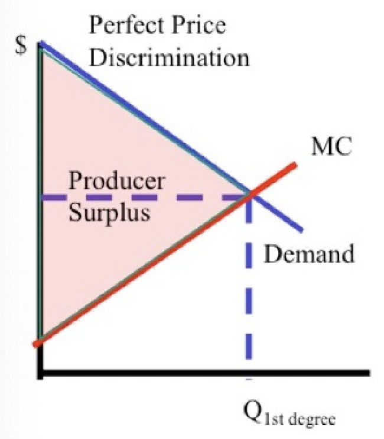

## Profit maximization under perfect competition

!!! note "Perfect compeition"

    1. Many unassociated buyers and sellers
    2. Identical products

    Price takers: $MR=P$

!!! tip "Cost expressions"

    **Fixed cost (FC)** are cost that do not vary with output, unlike **variable cost (VC)**.

    ```math
    \begin{align*}
    TC & = TVC + FC \\
    MC & = \frac{\Delta TC}{\Delta Q} \\
    AVC & = \frac{TVC}{Q} \\ 
    AC & = \frac{TC}{Q} \\
    & = AVC + \frac{FC}{Q} \\
    \end{align*}
    ```


!!! note "Profit"

    ```math
    \begin{align*}
    \text{Total Profit} &= \text{TR} - \text{TC} \\
    & = \text{P} \times \text{Q}  - (\text{FC} + \text{TVC})\\
    PS & = TR - TVC \\
    \end{align*}
    ```

    **Economic profit** includes the opportunity cost in total cost, whereas **accounting profit** does not.

!!! tip "Production runs"

    * **Short run** is the period over which **some inputs are fixed**
    * **Long run** is the period over which **all inputs are variable**. $TR=TC \to $ no economic profit.

    They are **not** defined by time, but by the ability to change inputs.

!!! tip "Profit maximization conditions"

    Maximize profit at $MR = P = MC$. This can be explained by:
    
    * $\because MR>MC\implies MP > 0 \implies$ firms can increase profit by increasing output
    * $\because MR<MC\implies MP < 0 \implies$ firms can increase profit by decreasing output
    * Note that $MR=MC$ does not represent the total profit, the total profit depends on $TR$ and $TC$.

!!! tip "Entry, exit and shutdown conditions"

    **Entry** is when new firms enter the market, **exit** is when existing firms leave the market, and **shutdown** is when a firm stops production temporarily.

    | Run       | Factor                  | Result                           |
    | --------- | ----------------------- | -------------------------------- |
    | Short run | Profit $>0$             | Entry of new firms               |
    | Short run | Profit $<0$             | Exit of existing firms           |
    | Short run | $P < AVC \cup TR < TVC$ | Shutdown at $P=\min\{AVC\} = MC$ |
    | Long run  | $P < AC \cup TR < TC$   | Exit at $P=\min\{AC\} = MC$      |

## Monopoly

!!! note "Simple monopoly"

    Ability to raise price > marginal cost without losing all customers

    Marginal revenue = marginal cost

!!! tip "Derivation of Marginal Revenue"

    Quantity: n

    Discrete: MR = TR (n)- TR (n-1)

    Continous: MR curve has twice the slope of D curve. (Coefficienct of $Q\times2$)

!!! info "Simple monopoly pricing"

    1. Find D curve
    2. Obtian MR curve ^^ (discrete vs continous)
    3. Find Profit-maximizing Q* **quantity** @ MR=MC
    4. Price is intersection of D curve and Q=Q*

    More elastic demand -> Lower price, smaller markup
    Less elastic demand -> Higher price, higehr markup

!!! note "Markup"

    ```math
    \text{Markup} = \frac{P - MC}{MC} = \frac{-1}{1+\eta_d} \implies \propto \frac{1}{\eta_d}
    ```

    Where $\eta_d$ is the price elasticity of demand.

!!! tip "Inefficiency"

    Q* < Qe -> DWL is the efficiency loss

    CS top part, PS bottom part including rectangle

    Price $P*$ Intersect(q=q*, D) is the price that monopoly charges. (Monopoly pricing)

    Revenue is $P*\times Q*$

    Total marginal cost (TVC) is the trapesium under left triangle and Q=Q*. 

    Producer surplus = Profit if no fixed cost (Profit=TR-TVC-FC=PS-FC) (PS=TR-TVC)

!!! info "Price control on monopoly"

    Price ceiling: New MR will be line from intersection of D and ceiling to yaxis and xaxis. Marginal revenue is constant for q < x(intersection).

    x(intersection) is maximum quantity that the market sells.

    Price ceiling @ D=MC -> Socially efficient quantity, profit maximizing, no dwl
    Price ceiling @ D=AC -> Zero profit, DWL triangle under x(intersection) and above MC. (Zero profit)

## Price discrimination


!!! tip "Price discrimination"

    Prices are charged on different customers for the same goods for reasons unrelated to difference in costs, in order to **maximize profits**.


The following are three types of price discrimination:

!!! tip "First degree price discrimination"

    **Perfect price discrimination** is where the monopolist charges based on the buyers' *maximum* WTP according to the marginal benefit. 
    
    $MR = MB$. All $CS$ is now extracted by the seller to be the $PS$.

    This *does not* happen in real life, as it is impossible to know the maximum WTP of each consumer. However, it is a useful theoretical concept.

    !!! eg "2020 Fall Final Q67-69"

        A souvenir store has six customers each day. Their willingness to pay for the souvenir are listed in the following table.

        | Customer | WTP |
        | --- | --- |
        | 1   | 92  |
        | 2   | 79  |
        | 3   | 64  |
        | 4   | 51  |
        | 5   | 36  |
        | 6   | 22  |

        The marginal cost is constant at \$28.

        (a) With perfect price discrimination, the store’s producer surplus will be ?

        (b) Suppose only consumers with willingness to pay below $70 will clip coupons and use them. The store owner will optimally provide a coupon that takes ? off

        (c) Continue with the previous question. The deadweight loss equals ? dollars

        <BlockSep />

        First, add $MR, MC$ columns:
        
        | Customer | WTP | MR  | MC  | Indicator              |
        | -------- | --- | --- | --- | ---------------------- |
        | 1        | 92  | 92  | 28  |                        |
        | 2        | 79  | 66  | 28  | < (b 1st min. MR > MC) |
        |          |     |     |     | < (b sep)              |
        | 3        | 64  | 64  | 28  |                        |
        | 4        | 51  | 38  | 28  | < (b 2nd min. MR > MC) |
        | 5        | 36  | 6   | 28  | < (a)                  |
        | 6        | 22  | -20 | 28  |                        |

        (a) $PS = 92+79+64+51+36-5\times28$

        (b) From the above table, we see that the coupon threshold is between WTP of customer 2 and 3. Then, for each separated group, find the minimum $MR>MC$ (maximize profit). Coupon amount = $66-38$

        (c) Because for each group, we set the price as $79$ and $51$, $CS = (92-79) + (64-51)$ $\implies DWL = 182 - CS - PS$.
        
        (Note: The $CS$ full formula is $CS = (92-79) + (79-79) + (51-51) + (64-51)$)
    
    !!! eg "2023 Spring Final Q66-68"

        Doris runs a wedding photography business in Utopia. The marginal cost of providing each unit of wedding photography service is $274. Doris has to incur a fixed cost of $70 per month. On a typical month, Doris expects to see 10 customer couples with the following reservation prices for wedding photography service. (Each customer couple will purchase either zero or one unit of wedding photography service.)

        | Customer couple | Reservation price ($ per unit) |
        | --------------- | ------------------------------ |
        | A               | 230                            |
        | B               | 260                            |
        | C               | 290                            |
        | D               | 320                            |
        | E               | 350                            |
        | F               | 380                            |
        | G               | 405                            |
        | H               | 430                            |
        | I               | 450                            |
        | J               | 470                            |

        (a) If Doris has to charge the same price for all wedding photography services, to maximize profit, she will charge ? per unit and sell to ? customer couples, and consequently make a monthly profit of ?.

        (b) Suppose Doris does not know each customer couple’s reservation price but she knows that all customer couples with a reservation price above $333 never use discount coupons. Those with reservation prices below $333 use them whenever they are available. If Doris makes coupons available in wedding magazines, those customer couples who clip and present them get to pay a discounted price for wedding photography service. Others pay the regular list price. To maximize profit, Doris should set the list price at ? per unit and the discount price at ? per unit

        (c) Suppose instead Doris knows each customer couple’s reservation price and can practice perfect price discrimination. Doris will provide wedding photography service to ? customer couples in total, and consequently make a monthly profit of ? in total.

        <BlockSep />

        First, add number of buyers at price and set price columns:

        | Customer | Price | No. buyers | Profit with set price @ price | Profit | Indicator |
        | -------- | ----- | ---------- | ----------------------------- | ------ | --------- |
        | A        | 230   | 10         | -510                          | 775    |           |
        | B        | 260   | 9          | -196                          | 819    |           |
        | C        | 290   | 8          | 58                            | 833    | (c)       |
        | D        | 320   | 7          | 252                           | 817    |           |
        |          |       |            |                               | ...    | (b sep)   |
        | E        | 350   | 6          | 386                           | ...    |           |
        | F        | 380   | 5          | 460                           | ...    | (a)       |
        | G        | 405   | 4          | 454                           | ...    |           |
        | H        | 430   | 3          | 398                           | ...    |           |
        | I        | 450   | 2          | 282                           | ...    |           |
        | J        | 470   | 1          | 126                           | ...    |           |

        Note: 
        * Profit with set price is calculated as $\text{No. buyers}\times(\text{Price} - MC) - FC$.
        * Profit is calculated as $SUM(\text{Price}) - MC \times \text{No. buyers} - FC$ Sum range from each row to end (count is same as no. buyers!)

        (a) Maximum profit is at $P=380$, $Q=5$, and profit of $460$ (Row F).

        (b) Find separated groups by threshold $333$. Then, discounted price is at $320$, and listed price unchanged ($380$).

        (c) Maximum profit is at $P=290$, $Q=8$, and profit of $833$ (Row C).




!!! tip "Second degree price discrimination"

    **Discrimination by Hurdles** is where the monopolist charges different prices based on the quantity consumed. 

    With *multiple* $MR$ curves, *part* of the $CS$ is extracted by the seller.
    
    Examples:
    * Buy one, get one half the price

!!! tip "Third degree price discrimination"

    **Market segmentation** is where the monopolist charges different prices based on the elasticity of different groups.

    With *multiple* $MR,MB$ curve pairs, *part* of the $CS$ is extracted by the seller.

    Conditions required:
    1. Ability to identify different groups with different elasticities
    2. Ability to prevent resale between groups
    
    Examples:
    * Movie tickets on weekdays vs weekends
    * Business vs economy flight tickets

    Note that [arbitrage](#arbitrage) makes it more difficult implement such discrimination.

    Recall that [market demand curve](supply-and-demand#market-demand-curve) is the **horizontal aggregation** of individual demand curves.

!!! note "Arbitrage"

    **Arbitrage** is the practice of buying a product in one market and selling it in another market at a higher price. 

    To prevent arbitratge, the *transportation cost* between the two markets must be **higher** than the **difference** of the prices.

!!! info "Anti-competitive behaviors"

    Other forms of price discrimination includes:

    **Tying**: a base good is sold at a **lower price**, and a *complementary good* is sold at a **higher price**.

    Examples:
    * Printer and ink
    * Game console and games

    **Bundling**: requiring products to be purchased toghether in a package.

    Examples:
    * Microsoft Office

    !!! eg "Example application"

        Given $MC=2, FC=3$, and bundling cost $bc=1$. The following table gives the WTP of two people P1 and P2 for goods A and B:

        | Persion \ Goods | A   | B   |     | WTP |
        | --------------- | --- | --- | --- | --- |
        | P1              | 9   | 5   |     | 14  |
        | P2              | 4   | 6   |     | 10  |
        |                 |     |     |     |     |
        | Min. cost       | 4   | 5   |     |     |

        To find the maximized profit:
        ```math
        \begin{align*}
            \text{Buy 1A 1B} & = 9 + 6 - 2\times2 - 3 & = 8\\
            \text{Buy 1A 2B} & = 9 + 5\times2 - 2\times3 - 3 & = 10\\
            \text{Buy 2A 1B} & = 4\times2 + 6 - 2\times3 - 3 & = 5\\
            \text{Buy 2A 2B} & = 4\times2 + 5\times2 - 2\times4 - 3 & = 7\\
            \text{Buy 1 bundle} & = 14 - 2\times2 - 3 - 1 & = 6\\
            \text{Buy 2 bundles} & = 10\times2 - 2\times4 - 3 - 1 & = 8\\
        \end{align*}
        ```

        Therefore, the seller should sell **separately** and make a profit of **10**.

