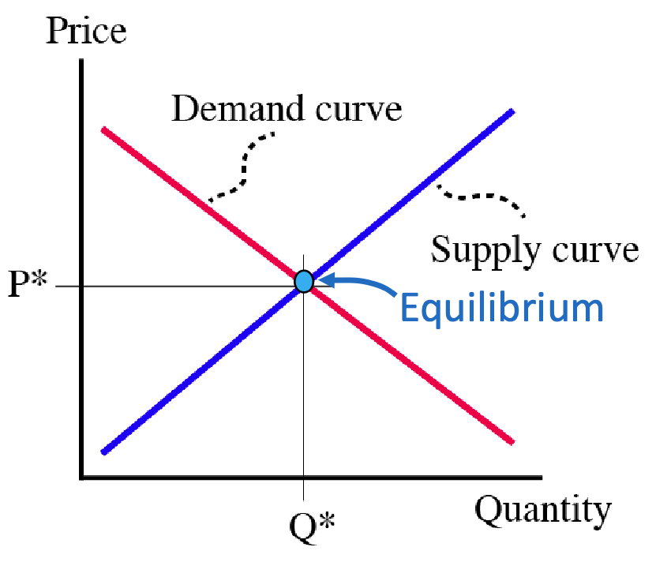

## Perfect competition market

We assume that the market is perfectly competitive, which means that:

- Buyers and sellers have negligible market power, they have to **take the price as given**.
- Demand and supply **jointly determine market price**.

## Curves

Here we study the relationship between price $P$ and quantity $Q$ in the market. Graphs are plotted $P-Q$.

!!! info "Demand curve"

    **Demand** describes the **consumers' desires** to purchase a good at different prices.

    ```math
    P_d = f(Q_d)
    ```

    Where $P_d$ is the price that consumers are willing to pay for a quantity $Q_d$.
    
    It is a **downward-sloping curve** because:
    1. $P \uparrow \rightarrow$ buyers no longer than to buy as much.
    2. $P \uparrow \rightarrow$ buyers will switch to alternative.

!!! tip "Market Demand curve"

    The market demand curve is the **horizontal aggregation** of individual demand curves of the consumers:

    ```math
    Q_{md} = Q_{d1} + Q_{d2} + \cdots
    ```

    To assess the $Q_d$ for market plot, we reference the topmost demand curve for each price.

!!! info "Supply curve"

    **Supply** describes the **producers' willingness** to sell a good at different prices.

    ```math
    P_s = f(Q_s)
    ```

    Where $P_s$ is the price that producers are willing to sell for a quantity $Q_s$.

    It is an **upward-sloping curve** because:
    1. $P \uparrow \rightarrow$ producers want to sell more.

    The **marginal cost** of production can be **directly** intepreted as the supply curve.

    !!! eg "Example"

        If $MC(q) = 2q$, then the supply curve is $P = 2Q_s$.

!!! tip "Market Supply curve"

    The market supply curve is the **horizontal aggregation** of individual supply curves of the producers:

    ```math
    Q_{ms} = Q_{s1} + Q_{s2} + \cdots
    ```

    To assess the $Q_s$ for market plot, we reference the bottommost supply curve for each price.

## Equilibrium

Here we study the plot of both demand and supply curves.

!!! tip "Market equilibrium"

    The **market equilibrium** is the point where the **quantity demanded equals the quantity supplied**:
    
    ```math
    P^* = P_s = P_d\\
    Q^* = Q_{s} = Q_{d}
    ```

    Where $P^*$ is the equilibrium price and $Q^*$ is the equilibrium quantity. At this point, the market of which buyers and sellers are **satisifed**, and the **market clears**.

<div className="max-w-80">



</div>

!!! tip "Excess"

    However, prices can be set above or below $P^*$, leading to **excess**:

    Excess is the $Q$ difference between the quantity demanded and supplied at a given price:

    | Name | Set price | Quantity difference |
    | --- | --- | --- |
    | Surplus | $P > P^*$ | $Q_s > Q_d$ |
    | Shortage | $P < P^*$ | $Q_s < Q_d$ |

!!! info "Trading Locus"

    The **trading locus** is the set of all possible prices and quantities that can be traded in the market. The quantity that can be traded is:

    ```math
    Q_\text{traded} = \min(Q_d, Q_s)\quad @P
    ```

!!! tip "Surplus of exchange (gain)"

    **Consumer and producer surplus** are the **gain** / loss from trade at a certain price. The **total economic surplus** is the sum of both.
    
    They can be calculated as:

    ```math
    \begin{align*}
        \text{Consumer surplus} &= \int_0^{Q^*} P_d - P^* \, dQ\\
        \text{Producer surplus} &= \int_0^{Q^*} P^* - P_s \, dQ\\
        \text{Total economic surplus TES} &= \int_0^{Q^*} P_d - P_s \, dQ\\
        & = \text{Consumer surplus} + \text{Producer surplus}
    \end{align*}
    ```
    <HLayout>
    <div>

    We can see that the TES is **maximized at equilibrium**. (Can check by increasing / decreasing quantity traded).

    Assuming all benefit of consumption goes to buyers, and all benefit of production goes to sellers, the TES @ $P^*$ is equilivalent to the **welfare to the society**.

    </div>

    <div className="max-w-80">

    

    </div></HLayout>

## Types of goods

!!! note "Categorizing goods"

    We can categorize goods by:

    - Type categorization
        - Normal
        - Inferior
        - Luxury
    - Comparative categorization
        - Substitute
        - Complements

!!! info "Type characteristics"

    | Type | $Q_d$ when $I \uparrow$ | Income elasticity of demand |
    | --- | --- | --- | 
    | Normal | $\uparrow$ | $>0$ | 
    | Luxury | $\uparrow$ | $>1$ |
    | Inferior | $\downarrow$ | $<0$ |

    Related: [Income elasticity of demand](elasticity/#income-elasticity-of-demand).

!!! info "Comparative characteristics"

    | Type of good B | $Q_d$ of good A when price of good B $\uparrow$ | Cross-price elasticity of demand |
    | --- | --- | --- | 
    | Substitute | $\uparrow$ | $>0$ | 
    | Complements | $\downarrow$ | $<0$ |

    Related: [Cross-price elasticity of demand](elasticity/#cross-price-elasticity-of-demand).

## Comparative Statics

Here we study the $\Delta P^*Q^*$ when the demand or supply curve shifts.

!!! tip "Shifting"

    If it is said that the demand / supply increases, the curve shifts to the right. This will lead to a higher $P^*$ and $Q^*$.

!!! tip "Demand shifters"

    The following factors can shift the demand curve.

    | Factor (increase) | Demand, Shift | Example | 
    | --- | --- | --- |
    | Population | $\uparrow, \rightarrow$ | Number of ppl and water demand | 
    | Income to normal goods | $\uparrow, \rightarrow$ | Income and restaurant demand |
    | Income to inferior goods | $\downarrow, \leftarrow$ | Income and instant noodle demand |
    | Price of substitutes | $\uparrow, \rightarrow$ | If electric car is expensive, ppl will buy more petrol cars |
    | Price of complements | $\downarrow, \leftarrow$ | If petrol is cheap, ppl will buy more petrol cars |
    | Expectation of future price | $\uparrow, \rightarrow$ | If ppl expect price of house to rise, they will buy more now |
    | Taste | $\uparrow, \rightarrow$ | If apple has recently been found to be healthy, ppl will buy more apples |

!!! note "Original consumers and producers and shifted curves"

    If the demand / supply changes due to a factor (e.g. country opening supply to another country), the original consumers and producers might be hurt or benefited.

    We can calculate the surplus for the original group by the area between **original demand / supply curve** and **new equilibrium price (line)**.
