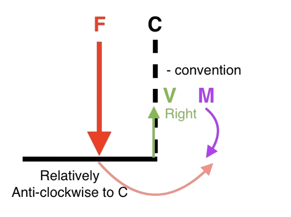

## Internal force in beams

When we consider the internal forces of a beam, we take a *cross section* and consider the forces acting on it. The internal forces are:

    - **Shear force** $V$ is the force acting parallel to the cross-section.
    - **Bending moment** $M$ is the moment generated by the variation of forces acting perpendicularly to the cross-section.

<Block variant="primary" title="Sign convention of internal forces">
$\{+\circlearrowright\}$ The idea is that if the acting force is relatively **clockwise** to the cross-section $C$, it is **positive**.
The following is the signs of internal forces for a *positive* moment:

    - **V:** $\circlearrowright$ (L $\uparrow$ R $\downarrow$)
    - **M:** $\curvearrowright\curvearrowleft$ (sagging moment is *positive*)
<BlockSep />

</Block>

<Block variant="knowledge" title="Couple moments">
When considering couple moments, their effect is **independent** of the point of application, but they have no effect if they are not in the cut of the beam during analysis. They **do not exert any force** on the beam, but will affect the reaction forces at supports.
</Block>

<Block variant="secondary" title="Finding internal forces by side">
To find the internal forces at cross-section $C$ *where no loads apply*, we consider the *left* and *right* side of the section:

    - **V:** $\sum F$ on either side
    - **M:** $\sum M_C$ on either side about $C$
Note that the sums are all **signed by convention**. (e.g. A force $F$ is positive if it points upwards on the left side.)
This also gives us the fact that $\sum F_L =\sum F_R$ and $\sum M_L =\sum M_R$, signed by convention on both sides.
</Block>

<Block variant="knowledge" title="Finding interal forces on left and right sides">
To find the interal forces at the left and right cross-section at a point $C$ where loads or moments apply:

    1. Left side: $\{\overset{R}{\uparrow}====\overset{V}{\downarrow}\overset{M}{\circlearrowleft}\dots\}$
    2. Right side: $\{\dots\overset{V}{\uparrow}\overset{M}{\circlearrowright}====\overset{R}{\uparrow}\}$
</Block>

## Diagramming internal forces

<Block variant="primary" title="Diagramming internal forces">
The two internal force diagrams are $V(x)-x$ and $M(x)-x$ diagrams. $V(x)$ gives the shear force $V$ at distance $x$ from the *left side* of the beam.
</Block>

<Block variant="secondary" title="Relation between internal forces">
The following is the relation between the internal forces:
$\frac{dM}{dx}=V     \frac{dV}{dx}=-w$
Where $w$ is the distributed load acting on the beam.

    - This tells us that the slope of the $M(x)$ diagram at an interval is the value of $V$ at that interval.
    - This tells us that the slope of the $V(x)$ diagram at an interval is the value of $-w$ at that interval.
</Block>

### Steps to follow

    1. Solve for reaction forces
    2. Draw the FBD of a cut from the leftmost side to a location with distance $x$ from the leftmost force *not analysed*
    3. Analyse the FBD of the cut (solve for $V$ and $M$)
    4. Draw the graphs in the cuts and repeat for all cuts

*Figurative steps:*

    1. $\to R_A, R_B...$
    2. $\{\overset{R}{\uparrow}\ \underbrace{=====}_x\ \overset{V}{\downarrow}\overset{M}{\circlearrowleft}\dots\}$
    3. $\to V, M$
    4. $\to V(x), M(x)$

To analyse a distributed load $w$, consider the FBD of the whole system on the left, then let $x$ be the distance from the leftmost force *analysed*:

\large
$\{\underset{\underset{R}{\uparrow}}{=}\underset{2}{==}\overset{\overset{F}{\downarrow}}{=}\underbrace{\overset{\overset{w\cdot x}{\downarrow}}{====}}_x\overset{V}{\downarrow}\overset{M}{\circlearrowleft}\dots\}$

### Signing conventions

By convention, we consider the **positive convention** with respect to the cross-section. That means, if the force is **clockwise** to the cross-section, it is **positive**..

## Bending stress

<Block variant="primary" title="Pure bending">
A **section** of the beam is said to be under *pure bending* if:
$V=0,     M\text{ constant}$
</Block>

<Block variant="knowledge" title="Netural axis">
The neutral axis always **passes through the centroid** of the beam. It is *netural* as the **length remains unchanged** for the surface that the axis passes through.
The distance from the netural axis is denoted $y$ (**positive downwards**).
</Block>

<Block variant="knowledge" title="Section modulus">
The section modulus is given by:
$Z=W_z=\frac{I}{y}$
</Block>

<Block variant="secondary" title="Bending stress">
The bending stress $\sigma$ is given by:
$\sigma=\frac{My}{I}$
Where $M$ is the bending moment, $y$ is the distance from the **neutral axis** (centroid), and $I$ is the **moment of inertia** of the section.
The formula also tells us that the bending stress is *proportional* to the distance from the neutral axis, and the neutral axis experiences *no stress*.
Related: [Moment of inertia](FIXME-sec:momentinertia)
</Block>

<Block variant="secondary" title="Maximum tensile and compressive stress">
$\sigma^\updownarrow_{max}=\frac{My_\updownarrow}{I}$
The maximum tensile and compressive stress $\sigma_{max}$ at a cross section is located at the top $\sigma^\uparrow$  and bottom edge $\sigma^\downarrow$. Note that **tensile stress is positive** (unlike tension which is negative).
</Block>