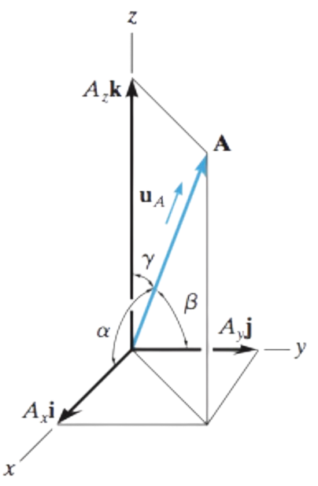

Vector can be represented by $\vec{F}$ or $\boldsymbol{F}$. The magnitude can be represented by $\|F\|$ or $F$.

They are vectors with magnitude 1: $$\hat{A}=\frac{\vec{A}}{\|\vec{A}\|}$$

<Block variant="knowledge" title="Relative vectors (resultant vectors)">
We can find the direction in which another object moves relative to you (your movement vector) by the following steps:
    1. Draw the two vectors pointing head-to-head
    2. Draw the resultant vector from the tail of the other vector to your vector
</Block>


## Coplanar vectors

<Block variant="primary" title="Cartesian vector notation">
In two dimensions, the Cartesian unit vectors $\boldsymbol{i}, \boldsymbol{j}$ are used to designate the directions of the x and y axes respectively.

$F=F_x \boldsymbol{i} + F_y \boldsymbol{j}$

Where $F_{x/y}$ is the $x/y$ component of $F$. And to find the x/y components we can use trigonometry:

$F_x=F\cos{\theta},     F_y=F\sin{\theta}$

Where the angle $\theta$ is the angle between $F$ and the x-axis.
</Block>


<Block variant="knowledge" title="Resultant force">
The resultant force $F_R$ can be found by the sum of the components of $F$:

$F_R=\sum F$

In Cartesian form, it's the same as adding all the terms together: $F_R=(F_{x1}+F_{x2})\boldsymbol{i}+(F_{y1}+F_{y2})\boldsymbol{j}$
</Block>


<Block variant="knowledge" title="Orientation of vector">
We always consider the angle between $F$ & $F_x$. It can be found by $\theta=\tan^{-1}\frac{F_y}{F_x}$.
</Block>


<Block variant="knowledge" title="Magnitude of forces">
The magnitude will simply be the square root of the sum of squared components of the force:

$\|F\|=\sqrt{F_x^2+F_y^2+\dots}$
</Block>


<Block variant="primary" title="Converting vectors to Cartesian form">
Given a vector $F$ with magnitude $\|F\|$ and angle $\theta$:

$\vec{F}=\|F\|\times\hat{F}=\|F\|\times\frac{r}{\|r\|}$

Where $r$ is the position vector of the point.
</Block>


## Vectors in 3D

The concepts above can be extended to 3D simply by adding another variable to the system.

<Block variant="secondary" title="Coordinate direction angles">
The direction of A is defined by the *coordinate direction angles*: $\alpha, \beta, \gamma$, which are measured between the tail of A and the positive $x, y, z$ axes.

```math
A\cos\alpha=A_x,\quad A\cos\beta=A_y,\quad A\cos\gamma=A_z
```

<div className="w-32 mx-auto">

</div>
</Block>