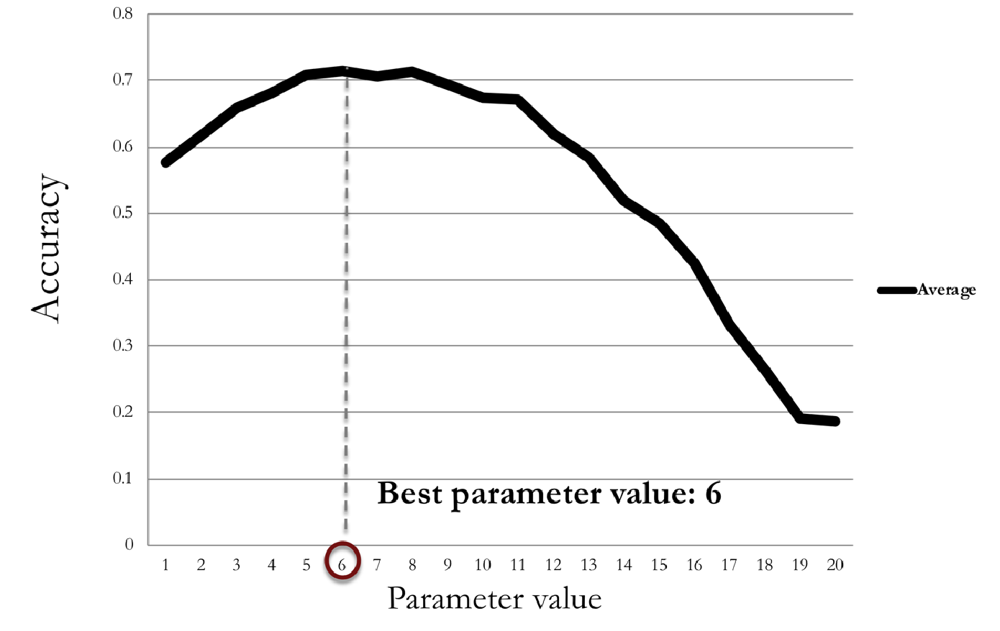

## Introduction

!!! tip "Classification and Regression Trees (CART)"

    A tree with leaf nodes that represent **predicted value** and non-leaf nodes that represent **decision rules**.

    To predict the outcome, follow splits in the tree.

    !!! eg "Example"

        ```mermaid
        graph LR
            A[X < 60] -->|Yes| B[Red]
            A -->|No| C[Y < 20]
            C -->|Yes| E[X < 85]
            C -->|No| F[Gray]
            E -->|Yes| G[Red]
            E -->|No| H[Gray]
        ```

        If $X=75, Y=10$, we follow the path and predict the outcome as `Gray`.
    
!!! tip "Minbucket"

    The minimum number of observations in a leaf node. If the number of observations in a leaf node is less than `minbucket`, the tree will not split further.

    Most complicated: $minbucket=1$ (each leaf node has only one observation).

    * Low `minbucket`: More flexibility in splitting → Deeper tree → Higher risk of overfitting.
    * High `minbucket`: Fewer splits allowed → Shallower tree → More generalized model, but potential underfit if too high.


!!! info "Random forest"

    Enhances prediction accuracy of CART. 

    Works by building large number of CART trees, and combining their predictions:

    1. Each tree can split on only a random subset of the variables
    2. Each tree is built from a "bagged"/"bootstrapped" sample of the data, by selecting observations randomly with replacement.

    This process is controlled by two parameters: 
    * `nodesize`: min. number of observations in a subset
    * `ntree`: number of trees to build, should not be too small as bagging may miss observations

    !!! eg "Example"

        Consider the following dataset, with 5 variables and 5 observations:

        | Obs | Var1 | Var2 | Var3 | Var4 | Var5 | Outcome |
        | :-: | :--: | :--: | :--: | :--: | :--: | :-----: |
        |  1  |  2   |  3   |  1   |  5   |  4   |    A    |
        |  2  |  1   |  2   |  3   |  4   |  3   |    B    |
        |  3  |  4   |  5   |  2   |  1   |  2   |    A    |
        |  4  |  3   |  4   |  5   |  2   |  1   |    B    |
        |  5  |  5   |  1   |  4   |  3   |  5   |    A    |

        **Step 1: Bootstrapping**
        Generate a random sample with replacement. For example:
        - Sample: Obs 1, Obs 3, Obs 5, Obs 1, Obs 4.

        **Step 2: Random selection of variables**
        For each tree, randomly select a subset of variables to consider at each split (e.g., `Var2`, `Var4`, `Var5`).

        **Step 3: Build the tree**
        Construct a CART tree using the bootstrapped sample and the selected variables. For example:
        - Root node splits on `Var4` > 3.
        - Left child splits on `Var2` ≤ 2.
        - Right child splits on `Var5` > 4.

        **Step 4: Repeat**
        Repeat Steps 1–3 to build `ntree` trees (e.g., 100 trees).

        **Step 5: Combine predictions**
        Each tree votes on the outcome for new data. The final prediction is based on majority vote (classification).

## Cross validation

!!! info "K-fold cross validation"

    A method to evaluate the performance of a model by dividing the data into `k` subsets, training the model on `k-1` subsets, and testing it on the remaining subset. This process is repeated `k` times, with each subset being used as the test set once.

    The final performance metric is the average of the performance metrics from each fold.



!!! tip "Complexity parameter (cp)"

    A parameter to control cross validation, controlling the size of the tree. `cp` $\in [0,1]$.

    * Low `cp`: More splits allowed → Deeper tree → Higher risk of overfitting.
    * High `cp`: Fewer splits allowed → Shallower tree → More generalized model, but potential underfit if too high.

## CART in R-lang

### Fitting cart model by minbucket

```r
# Split data randomly into training and test sets
library(caTools)
set.seed(123) # for reproducibility
split = sample.split(data$DV, SplitRatio = 0.7)
Train = subset(data, split == TRUE)
Test = subset(data, split == FALSE)

# Fit a CART model
library(rpart)
Tree = rpart(DV ~ ., data = Train, method = "class", minbucket = 5)
# Plot the tree
library(rpart.plot)
prp(Tree)
```

### Making predictions

```r
# Make predictions
Predictions = predict(Tree, newdata = Test, type = "class")
table(Test$DV, Predictions) # Print confusion matrix
```

```r
   Predict CART
          0 1
0        41 36
1        12 31
```

### Fitting cart model by cp

```r
# K-fold cross validation
library(caret)
numFolds = trainControl(method = "cv", number = 10)
cpGrid = expand.grid(.cp = seq(0.01, 0.5, 0.01)) # from 0.01 to 0.1 with steps of 0.01
# Perform cross validation
train(DV ~ ., data = Train, method = "rpart", trControl = numFolds, tuneGrid = cpGrid)
```

```r
# Output of cross-validation
CART 

396 samples  
    6 predictors  
    2 classes: '0', '1'  

No pre-processing  
Resampling: Cross-Validated (10-fold)  
Summary of sample sizes: 357, 356, 356, 356, 356, 357, ...  

Resampling results across tuning parameters:  

| cp   | Accuracy | Kappa       |
|------|----------|-------------|
| 0.01 | 0.6010   | 0.1869      |
| 0.02 | 0.6185   | 0.2159      |
| 0.03 | 0.6134   | 0.2142      |
...

Accuracy was used to select the optimal model using the largest value.  

The final value used for the model was cp = 0.19.
```

```r
# Create CART model with cp
CART = rpart(DV ~ ., data = Train, method = "class", cp = 0.19)
```