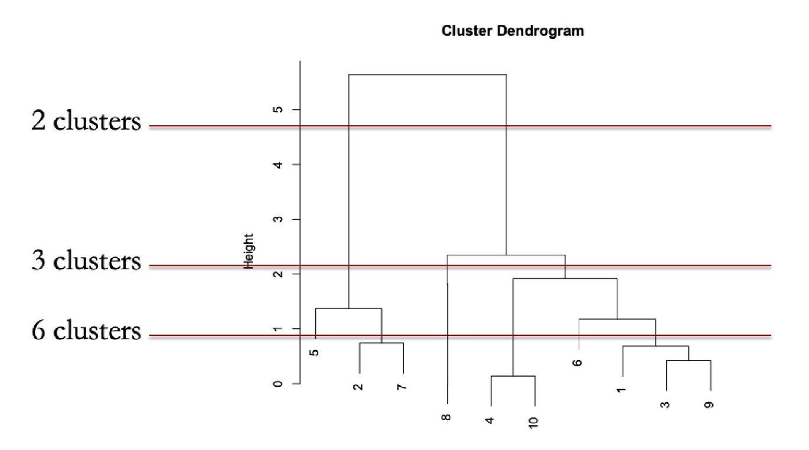

## Introduction

Segments data and assigns them to groups based on their similarity. The goal is to find a natural grouping of the data.

!!! note "Euclidean distance"
    
    The distance between points $i$ and $j$ with $k$ attributes is:

    ```math
    d_{ij} = \sqrt{\sum_{k=1}^{K}(x_{ik} - x_{jk})^2}
    ```

!!! info "Centroid distance"

    A **centroid** is a point with value in each attribute that is the average of all points in the cluster, given by:

    ```math
    c_k = \frac{1}{n_k} \sum_{i=1}^{n_k} x_i
    ```

    where $n_k$ is the number of points in cluster $k$ and $x_i$ is the $i$-th point in cluster $k$.

    *Centroid distance* is the distance between centroids of two clusters. 

!!! tip "K-means clustering"

    Algorithm:
    
    1. Pick $k$ as wanted, then randomly assign each point to one of the clusters
    2. Repeat the following steps until no improvement is made:
        1. Compute the centroid of each cluster
        1. Reassign each point to the closest centroid

!!! tip "Hierarchical clustering"

    Algorithm:
    
    1. Start with each point as a separate cluster.
    2. Merge the two closest clusters, until all points are in one cluster.
    3. Draw a **dendrogram** to visualize the clusters.
    4. Draw horizontal line to cut the dendrogram. Num. of vertical lines the cut intersects is the number of clusters.
        * Good choice if line has lots of vertical *wiggle room* (i.e. two clusters are farther from each other)
        * Balance the objective with *wiggle room*



!!! info "Comparing clustering methods"
    
    * K-means: faster, but $k$ must be specified.
    * Hierarchical: can help with choosing $k$, but slower as distance computations, might not be feasible for large datasets.