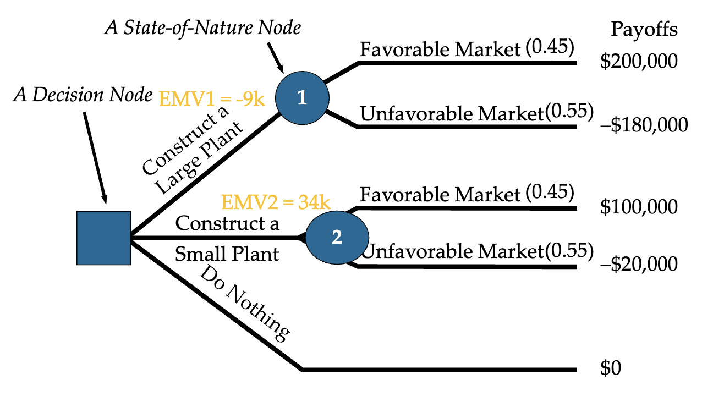
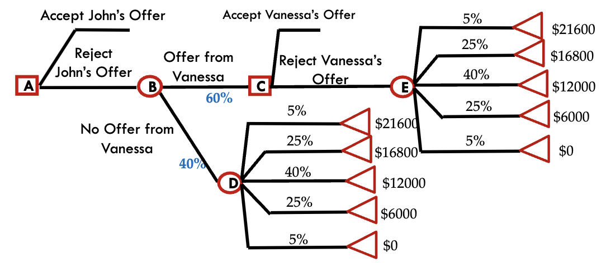

**Analytics** is the science of building models that help us make better decisions.

- **Descriptive** analytics: identify patterns in data.
    * [Clustering](clustering)
    * [PCA](pca)
    * Hypothesis tests
    * Visualizations
- **Predictive** analytics: forecast future trends.
    * [Linear regression](linear-regression)
    * [Logistic regression](logistic-regression)
    * [CART](cart)
    * [Random forests](cart)

## Decision making

Six Steps in Decision Making
- Clearly define the problem (Goal to achieve)
- List the possible alternatives
- Identify the possible outcomes or states of nature
- List the payoff of each alternative in each state of nature
- Select one of the decision theory models
- Apply the model and make your decision

!!! note "Types of decision making environments"
    
    Decisions can be made under different conditions:

    - **Certainty**: all information is known.
    - **Risk**: probabilities of outcomes are known.
    - **Uncertainty**: probabilities of outcomes are not known.

## Decision making under risk

!!! tip "Expected monetary value"

    These quantities are used in decision making under risk:

    | Metric | Shorthand | Formula |
    | :---: | :---: | :---: |
    | Expected Monetary Value | EMV | $\sum(\text{Payoff}\times\text{Probability})$ |
    | Expected Value with Perfect Information | EVwPI | $\sum(\text{Best Payoff}\times\text{Probability})$ |
    | Expected Value of Perfect Information | EVPI | $EVwPI - \max\{EMV\}$ |

    Our goal is to maximize the $EMV$ under risk. 

    !!! eg "Example practice"

        Consider the following example:

        | State of Nature | Favorable Market (Profit in $) | Unfavorable Market (Profit in $) | EMV ($) |
        | :---: | :---: | :---: | :---: |
        | Construct a large plant | 200,000 | -180,000 | -9,000 |
        | Construct a small plant | 100,000 | -20,000 | 34,000 |
        | Do nothing | 0 | 0 | 0 |
        | Probability | 0.45 | 0.55 | |

        We want to maximize the $EMV$ under risk. Hence we choose "Construct a small plant".

        Given the opportunity, to decide if we should pay a price for additional information, we have to evaulate $P \leq EVPI$. 

        Given the price of $P = 65,000$:
        ```math
        \begin{align*}
            EVwPI = 0.45 \times 200,000 &= 90,000\\
            EVPI = 90,000 - 34,000 &= 56,000\\
            P &\gt EVPI
        \end{align*}
        ```

        Therefore, we should not pay for additional information.

!!! info "Expected opportunity loss"

    Opportunity loss is the **difference of payoff** between a decision and the alternative best decision.

    | Metric | Shorthand | Formula |
    | :---: | :---: | :---: |
    | Expected Opportunity Loss | EOL | $\sum\text{Opp. Loss}\times\text{Probability}$ | 

    Our goal is to minimize the $EOL$ under risk.
    
    * The choice we take based on $\max\{EMV\}$ is the *best decision*, which the same decision has the $\min\{EOL\}$ as well.
    * $\min\{EOL\} = EVPI$

    !!! eg "Restoring opportunity loss table"

        To convert the previous table to an opportunity loss table, we can calculate the opportunity loss for each decision and state of nature.

        * Large-favorable: $200-200=0k$ as self is best
        * Small-favorable: $200-100=100k$ as large is best
        * Small-unfavorable: $0-(-20)=20k$ as do nothing is best
        * etc...

        | State of Nature | Favorable Market (Opp. Loss in $) | Unfavorable Market (Opp. Loss in $) | EOL ($) |
        | :---: | :---: | :---: | :---: |
        | Construct a large plant | 0 | 180,000 | 99,000 |
        | Construct a small plant | 100,000 | 20,000 | 56,000 |
        | Do nothing | 200,000 | 0 | 90,000 |
        | Probability | 0.45 | 0.55 | |
    
    !!! eg "Restoring profit table"

        | Opp. Loss | State 1 | State 2 |
        | --- | --- | --- |
        | A | 5 | 1 |
        | B | 0 | 3 |
        | C | 6 | 0 |
        | Prob. | 0.3 | 0.7 | 

        We can only restore payoff tables if at least one row of a state is given. Let A-1 = 1, C-2 = 4:

        | Payoff | State 1 | State 2 | 
        | --- | --- | --- |
        | A | 1 | 3 | 
        | B | 6 | 1 |
        | C | 0 | 4 |

    !!! eg "Example practice"

        The Café buys donuts each day for \$40 per carton of 20 dozen donuts. Any cartons not sold are thrown away at the end of the day. If a carton is sold, the total revenue is \$60

        | Daily Demand (Cartons) | Probability | Cumulative Probability |
        | :---: | :---: | :---: |
        | 4 | 0.05 | 0.05 |
        | 5 | 0.15 | 0.20 |
        | 6 | 0.15 | 0.35 |
        | 7 | 0.20 | 0.55 |
        | 8 | 0.25 | 0.80 |
        | 9 | 0.10 | 0.90 |
        | 10 | 0.10 | 1.00 |
        | **Total** | **1.00** |

        **Should we reduce the order size $Q$ from 6 to 5? What is the EMV of $Q=5$?**

        We identify the decision to make is the order size: $Q=6,Q=5$. Then, we  construct the monetary payoff table for different *states of nature* (demand $D$) and calculate the *Expected Monetary Value*.

        The payoff is calculated as $D \times 60 - 40 \times Q$.

        | Payoff | D = 4 | D = 5 | D = 6 | D = 7 | D = 8 | D = 9 | D = 10 | EMV |
        | --- | --- | --- | --- | --- | --- | --- | --- | --- |
        | Q = 7 | -40 | 20 | 80 | 140 | 140 | 140 | 140 | 104 | 
        | Q = 6 | 0 | 60 | 120 | 120 | 120 | 120 | 120 | 105 |
        | Q = 5 | 40 | 100 | 100 | 100 | 100 | 100 | 100 | 97 | 
        | Prob. | 0.05 | 0.15 | 0.15 | 0.20 | 0.25 | 0.10 | 0.10 | 1.00 |

        We want to maximize the $EMV$ under risk. Hence we choose $Q=6$.

        **If we can only choose between 6 and 7, what is the EVPI?**

        $EVwPI = 0 * 0.05 + 60 * 0.15 + 120 * 0.15 + 140 * (1-0.05-0.15*2) = 118$

        $EVPI = 118 - 105 = 13$

        <BlockSep />

        We can also calculate using the two properties of $EOL$. We know $\max\{EMV\}$ is the best decision, which is the same decision that has the $\min\{EOL\}$ as well. 

        $EOL(6) = 0 + 20 * (.20+.25+.1+.1) = 13$


!!! note "Sensitivity analysis"

    We can let the probability of a state of nature to be $p$ to work out curves for the $EMV$. Then, we can deduce the **ranges of $p$** in which we should take an action. 

    Consider the following example:

    | State of Nature | Favorable Market (Profit in $) | Unfavorable Market (Profit in $) | EMV ($1000) |
    | :---: | :---: | :---: | :---: |
    | Construct a large plant | 200,000 | -180,000 | 200p - 180(1-p) |
    | Construct a small plant | 100,000 | -20,000 | 100p - 20(1-p) |
    | Do nothing | 0 | 0 | 0 |
    | Probability | p | 1-p | |

    We can plot the $EMV$ as a function of $p$ to find the range of $p$ in which we should take an action, or use an equality to find the changeover point.

## Decision trees

We can use a decision tree to visualize the decision-making process. 

The following are parts of the tree:
- $\square$ **Decision nodes**: Where decisions are made.
- $\bigcirc$ **State-of-Nature nodes**: Where probabilities are assigned.
- $\triangle$ **Payoff nodes**: Where payoffs are assigned.
- **Branches**: Represent the possible outcomes.



!!! info "Finding the best decision"

    The goal of a decision tree is to find the best choice to make. We can backtrack, start by finding the $EMV$ of each $\bigcirc$ leaves. Travelling upwards, pick the decision at $\square$ that maximizes $EMV$,and assign that $EMV$ to the $\square$. Continue until the root node.

    !!! eg "Example"

        Consider the following example tree:

        

        Starting from the leaves:

        $EMV_E = EMV_D = 21600\times.05+16800\times.25+12000\times.4+6000\times.25=11580$

        For $\square C$, we choose "Accept Offer" as $14000>11580$.

        $EMV_B = 0.6\times14000+0.4\times11580=13032$

        For $\square A$, we choose "Reject Offer" as $12000<13032$.

        Hence, best decision is to reject John's offer, and accept Vanessa's offer if presented.