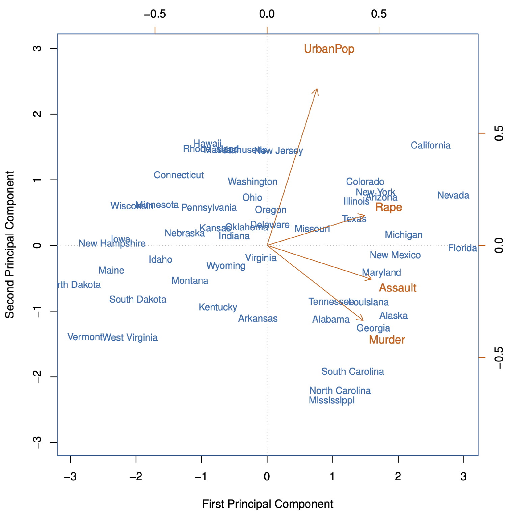
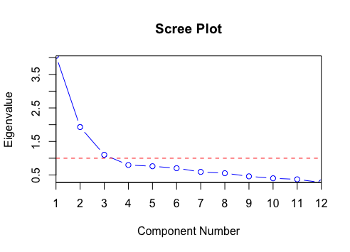

## Introduction

PCA summarizes a dataset with a **small number** of representative variables that contain the most information, by finding a set of variables that have **maximal variance** and are mutually **uncorrelated**. 

!!! tip "First principle component"

    A linear combination of the features $X_1, X_2, \ldots, X_p$ that has the *largest* variance:

    ```math
    PC_1 = \phi_{11}X_1 + \phi{21}X_2 + \ldots + \phi_{p1}X_p
    ```

    We refer to $\phi{i1}$ as the **loadings** of the $PC_1$.

!!! tip "Second principle component"

    A linear combination of the features $X_1, X_2, \ldots, X_p$ that has the *largest* variance, among all combinations **uncorrelated** with $PC_1$:

    ```math
    PC_2 = \phi_{12}X_1 + \phi{22}X_2 + \ldots + \phi_{p2}X_p
    ```

    Uncorrelation is good because an additional column always provide us new information.

!!! info "PCA Biplot"

    * Blue names represent scores of the first two $PC$s.
    * Red names represent the loadings vectors of the first two $PC$s. Top axis is the loading of the first $PC$ and right axis is the second $PC$.

    Changing the signs of $PC$'s will flip or rotate the biplot but it does not change the PCA result (as variance is not affected by the sign).

    !!! eg "Example"

        The word `UrbanPop` is positioned at $(0.25,0.75)$, which means that the loading of the first $PC$ is 0.25 and the second $PC$ is 0.75. 

        

        * Overall, we see that crime-related variables are located close to each other, and `UrbanPop` is located far from them.
        * States on the far right have high crime rates, while states on the far left have low crime rates.
    
!!! info "Proportion Variance Explained"

    To understand the strength of each component, we can do PVE to see how much variance is explained by each component. 

    A **scree plot** is a line plot of *PVE* against *number of* $PC$s. The elbow point is the point where the curve starts to flatten out, which would be the number of $PC$s to keep. 

    *In the image below, the conclusion is to use 3 PCs*.



## PCA in R-lang

```r
> pr.out <- prcomp(data, scale = TRUE)
> str(pr.out)
> pr.out$center # column mean
> pr.out$scale # column standard deviation
> pr.out$rotation # loadings
               PC1         PC2         PC3         PC4
Murder    -0.5358995 -0.4181809  0.3412327  0.64922780
Assault   -0.5831836 -0.1879856  0.2681484 -0.74340748
UrbanPop  -0.2781909  0.8728062  0.3780158  0.13387773
Rape      -0.5434321  0.1673186 -0.8177779  0.08902432

> biplot(pr.out, scale = TRUE) # Draw the PCA Biplot

# PVE analysis
> summary(pr.out)
                           PC1    PC2    PC3    PC4
Standard deviation         1.5749 0.9949 0.5971 0.4165
Proportion of Variance     0.6201 0.2474 0.0891 0.0434
Cumulative Proportion      0.6201 0.8675 0.9566 1.0000
```