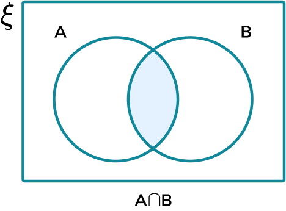
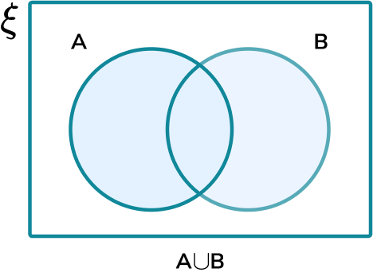
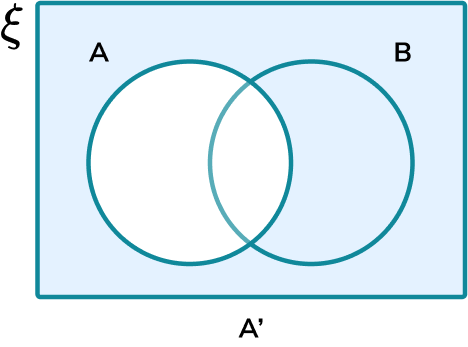

## Probability notation and event types

|  |  |  | 
| :---: | :---: | :---: |
| A and B | A or B | Not A |
| Intersection | Union | Compliment |

!!! tip "Mutually exclusive"

    A and B mutually exclusive $\leftrightarrow P(A\cap B) = 0\ \|\|\ P(A\cup B) = P(A) + P(B)$.

    This means that the events cannot happen at the same time.

!!! tip "Collectively exhaustive"
    
    A and B collectively exhaustive $\leftrightarrow P(A\cup B) = 1$

    This means that one of the events must happen.

!!! tip "Conditional probabilities"

    The probability of A given that B occurs: $P(A\ \|\ B) = \frac{P(A\cup B)}{P(B)}$


!!! tip "Independent events"

    A and B independent $\leftrightarrow (A) \times P(B) = P(A\cap B)$.

    Being independent means that the probability of an event *has no influence on the other*

    !!! example "Example"

        Two dice R and B are rolled.

        - Case A: Sum exactly 7
        - Case B: Sum exactly 12
        - Case C: Red die == 6

        1. Are A and C independent? 
        2. Are B and C independent?

        <BlockSep/>

        - $P(A) = \frac{6}{36} = \frac{1}{6}$
        - $P(B) = \frac{1}{36}$
        - $P(C) = \frac{6}{36} = \frac{1}{6}$

        For question 1:
        ```math
        \begin{align*}
        P(A)\times P(C) &= \frac{1}{36}\\
        P(A\cap C) = P(6,1) &= \frac{1}{36},\quad\text{as R must be 6 and B must be 1}\\
        \therefore P(A)\times P(C) &= P(A\cap C)\implies A\ \text{and}\ C\ \text{are independent}
        \end{align*}
        ```

        For question 2:
        ```math
        \begin{align*}
        P(B)\times P(C) &= \frac{1}{216}\\
        P(B\cap C) = P(6,6) &= \frac{1}{36}\\
        \therefore P(B)\times P(C) &\neq P(B\cap C)\implies B\ \text{and}\ C\ \text{are not independent}
        \end{align*}
        ```


