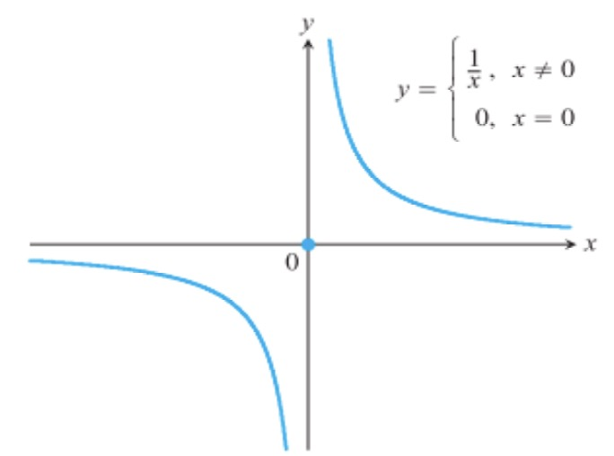

## Introduction to the concept of limit

<HLayout><div>
We can conceptualize that the limit of a function $f(x)$ is $L$ as $x$ approaches $c$, given that we can make $f(x)$ *as close to $L$ as we want* for all $x$ sufficiently close to $a$, from both sides, *without actually letting $x$ be $a$*. We can write this as:
```math
\lim_{x\to a}f(x)=L
```
</div>
<div>

</div></HLayout>
## One-sided limits
There are two sides that $x$ can tend to a number. We can write it as $x\to n^-$ and $x\to n^+$, which represents from the negative (left) / positive (right) side.
## Existence of limits

<Block variant="theorem" title="Condition for limit to exist">
The limit for a function $f(x)$ only exists if and only if:
```math
\lim_{x\to a^+}f(x)=\lim_{x\to a^-}f(x)
```
WARNING: If the **limit is** $\mathbf{\infty}$ it **doesn't exist**.
</Block>
<HLayout><div>
For this example, when $x\to 0^-, y\to -\infty$.
Similarly, as $x\to 0^+, y\to +\infty$.
Hence, we can conclude that the limit for this function as $x\to 0$ doesn't exist.
</div>
<div>

</div></HLayout>
## Continuity
