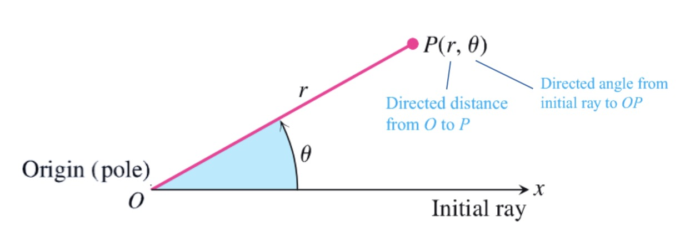

## Polar Coordinates

<Block variant="primary" title="Equations relating Rolar and Cartesian coordinates">
We can convert a Cartesian equation to polar equation using:
$x=r\cos\theta,     y=r\sin\theta$
We can also see that:
$r^2=x^2+y^2.     \tan\theta=\frac{y}{x}$
The polar equation for the circle $r^2 = x^2 + y^2$ is simply $r=a$.
</Block>

<Block variant="knowledge" title="Graphing">
We can easily graph any polar formula $r=f(\theta)$ following the following steps:

    1. Plot $r\ -\ \theta$ graph. If the function involves trigo functions, we can simply translate its graph. The height at a certain point is the distance from the origin.
    2. Then we can simply trace the graph from the left, and plot the points according to the distance from the origin at each angle. Using the eqations above, we can also find the Cartesian coordinates.
    3. If the graph is symmetric, we can simply copy the other half.
</Block>

## Hyperbolic Functions

<Block variant="primary" title="Hyperbolic functions">
Hyperbolic functions are defined as:
$\sinh x=\frac{e^x-e^{-x}}{2},    \cosh x=\frac{e^x+e^{-x}}{2}$
</Block>

<Block variant="knowledge" title="Hyperbolic identities">
The following identities hold for hyperbolic functions:

    1. $\cosh^2x-\sinh^2x=1$
    2. $\cosh 2x=\cosh^2x+\sinh^2x$
    3. $\sinh 2x=2\sinh x\cosh x$
</Block>

<Block variant="knowledge" title="Derivatives of hyperbolic functions">
The derivatives of hyperbolic functions are:

    1. $\frac{d}{dx}\sinh x=\cosh x$
    2. $\frac{d}{dx}\cosh x=\sinh x$
    3. $\frac{d}{dx}\sinh^{-1}x=\frac{1}{\sqrt{x^2+1}}$
    4. $\frac{d}{dx}\cosh^{-1}x=\frac{1}{\sqrt{x^2-1}}$
</Block>