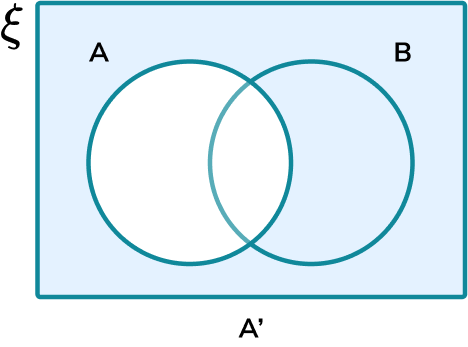

The formula for combinations, also known as the binomial coefficient, is given by:

$
\binom{n}{r} = \frac{n!}{r!(n-r)!}
$

Which represents the number of ways to choose r items from a set of n distinct items without regard to their order.

Pascal's rule is given by $\binom{n+1}{r}=\binom{n}{r}+\binom{n}{r-1}$
Probability measures the likelihood of an event happening. It assigns a numerical value between 0 and 1 to an event, where 0 represents an impossible event and 1 indicates a certain event.\\For example, the probability of flipping a fair coin and getting heads is 0.5, as there are two equally likely outcomes (heads or tails).\\The key to understanding probabilities (or anything else) is practice.


## Infinite sets


| **Set** | **Description** | **Example** |
| :--- | ---: | :--- |
| $\mathbb{Z}$ | Integers | $-1,0,1$ |
| $\mathbb{N}$ | Natural | $0,1,2$ |
| $\mathbb{R}$ | Real | Any number $\frac{4}{7}, 0.1, 1, \pi$ |
| $\mathbb{Q}$ | Rational | Any number that can be expressed as a fraction $\frac{22}{7}$ |
| $\mathbb{C}$ | Complex | $a+bi$ |


## Venn diagrams

Venn diagrams illustrate concepts like intersections, unions, which is a good way to visualize probabilities. The overlapping regions indicate elements that belong to multiple sets, while non-overlapping regions represent elements unique to specific sets.

In this example, two circles are drawn to represent sets A and B. The overlapping region is labeled as the intersection of sets A and B, denoted by A $\cap$ B.


## Probability notation and event types


|  |
| :--- | ---: |
| A and B | A or B | Not A |
| Intersection | Union | Compliment |


The probability of A given that B occurs: $P(A\ \|\ B) = \frac{P(A\cup B)}{P(B)}$

A and B are said to be *independent* if $P(A) \times P(B) = P(A\cap B)$.

Being independent means that the probability of an event *has no influence on the other*


## Random variables

Random variables are denoted with capital letters $X$\\
The possible outcomes are denoted with regular letters $x$\\
Probability that the outcome of $X$ is $x$ is denoted by $P(X=x)$
$E(X^n)=\sum(x^n\cdot P(X=x))$ gives the expected value, which represents the mean value (outcome) of the random variable.

$Var(X)=E(X^2)-E(X)^2$ gives the variance, which is a measure of the variability of the random variable's outcomes.
$E(X+Y)=E(X)+E(Y)$, which any addition / subtraction function within $E()$ can be expanded.\\\
If $X$ and $Y$ are independent:
$Var(X+Y) = Var(X) + Var(Y),         E(XY)    = E(X)\cdot E(Y)$\\\
$for\ Y=aX+b:$ $E(Y)=aE(X)+b,         Var(Y)=a^2Var(X)$


## Joint random variables

Joint random variables are in the form $P(X=x, Y=y)$. We can visualize the joint distribution in the following way:


| $X \symbol{92}Y$ | $x_1$ | $x_2$ |  |
| :--- | ---: | :--- | :--- |
| $y_1$ | $P(X=x_1, Y=y_1)$ | $P(X=x_2, Y=y_1)$ | $P(Y=y_1)$ |
| $y_2$ | $P(X=x_1, Y=y_2)$ | $P(X=x_2, Y=y_2)$ | $P(Y=y_2)$ |
|  | $P(X=x_1)$ | $P(X=x_2)$ |  |


Note that the sum of a column or row results in the corresponding variable's probability of outcome.

$E(X+Y)   = \sum((x+y) P(X=x, Y=y))$\\
$E((XY)^n) = \sum((xy)^n P(X=x, Y=y))$


## Random variables of random variables (outcomes)

For random variables modelled in the following way:
```math
\bar{X}=X_1+X_2+\dots+X_n
```
We can deduce that:
```math
E(\bar{X})=\frac{E(X_1)+\dots+E(X_n)}{n}=\frac{nE(X)}{n}
```
```math
Var(\bar{X})=\frac{Var(X_1)+\dots+Var(X_n)}{n^2}=\frac{nVar(X)}{n^2}
```

$E(\bar{X})   = E(X)$\\
$Var(\bar{X}) = \frac{Var(X)}{n}$